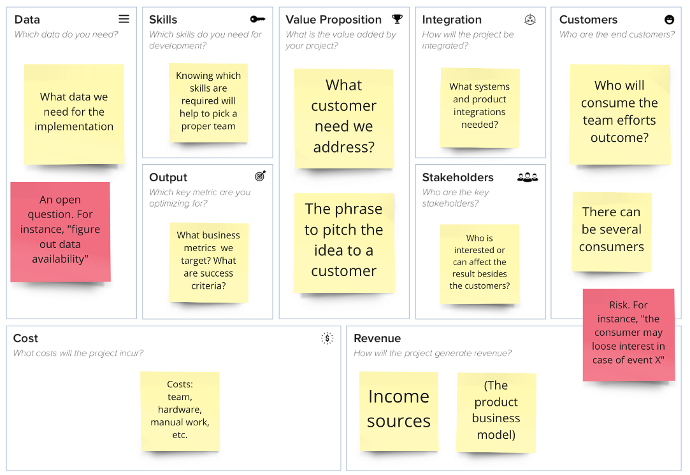
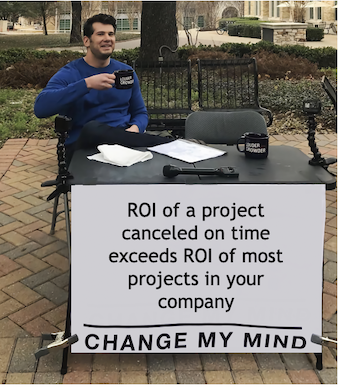

# AI Canvas

## A Problem We Solve

Imagine you are the Lead Data Scientist. Somebody approaches you in the elevator and tells you about the model they need.

Their idea is to have a chat where call-center agents answer clients' questions. It would be great to have a bot providing automated responses instead!

You tell the person, "Say no more! Where do we begin? For starters, let's check what dialog data we have collected so far and what state-of-the-art (SOTA) approaches we can apply there..."

Wait! Isn't it a bit early to begin the work? But what can go wrong?

Anything can go wrong! The CRM team might decline to integrate your model, the potential ROI might turn out to be negative, the manager in charge might reject changing call-center operations, the business team might have inflated expectations and reject your results, and many other things. These issues (risks) may kill the project.

It's not time yet. One must synchronize all the stakeholders' expectations. If we face one of the challenges mentioned above, we can fix it. If it is too harsh, we can cancel the project before it begins and save several months of highly qualified and expensive specialists' work.

Let's discuss our inputs and expectations now! To hold this meeting, we will use AI Canvas.

!> AI Canvas lays out an AI project's key assumptions in a one-page concept template (vision).

## AI Canvas Structure

AI Canvas consists of 9 blocks. Each block addresses a critical question to answer before the project starting the project.

Fill the blocks with project ideas written on sticky notes during the kick-off meeting.

The goal is to ensure that a project concept is complete and consistent.

## How to Use AI Canvas

Gather all the stakeholders:

* Business team (internal clients)
* Your team members
* The subject matter experts
* Representatives of the related teams

Involve those who can provide project feedback.

## How to Fill in AI Canvas

* Although the order isn't typically critical, we recommend that you start with "Customer" and "Value proposition".
* Welcome ideas from anyone. Any participant can place a sticky note!
If you lack sufficient information on a subject, place a sticky note question.* Don't get stuck in discussions. Mark such questions with color; this will help to process them later.
* After the board is complete, check it yourself. Ask other participants if the whole picture fits.
* If AI Canvas requires another round, hold the next meeting to process the previously collected questions.
* A critical stakeholder missed the meeting? Don't worry. Reach out to him and validate all the results later.
* If you complete an AI Canvas and discover that the project makes no sense — celebrate that! You saved time for other projects and evaded demotivation from needless work.

## AI Canvas Example

So, you have held a meeting and revealed a handful of interesting facts:

> The business team thought the bot should answer 80% of the questions, while, at least this year, you estimate this number as 15%.
COO is against premium segment automation, which leaves you with the mass market segment only.
The mass-market segment staff consists of 15 agents. You can reduce the headcount by 2 or 3. Does this optimization even justify the project?
COO wants to speed up the answers to reduce the churn.
The CRM team skipped the meeting. They are too busy transitioning to a new system and not ready to integrate now.

You agreed to elaborate on three questions and decided to meet again in a week.

What happened just now? You revealed the critical risks you need to eliminate before embarking upon the project's execution.

## When AI Canvas is a Good Idea

* A company starts a new project or product and needs to sync stakeholders' expectations.
* As an AI consultant, you need to agree on success criteria with your client before starting a project.

## When there's no Need to Use AI Canvas

* If a project is small, like an existing product model modification, a separate meeting would be excessive. Stating a product hypothesis would be sufficient.

## AI Canvas Benefits

* It identifies inflated business expectations in advance. 
* It will enable discarding projects that do not make sense.
* It ensures everyone pursues the same business goal.

## Why use AI Canvas instead of Requirements Specification

Why is an AI Canvas better than a traditional project vision? Let an analyst write and approve it with all the parties involved. Why go through all the trouble and hold extra meetings?

* A good project concept is creative work that requires brainstorming with all the key stakeholders.
* A big project concept may require 1-2 meetings, unlike a complex document, which may take months.
* Some stakeholders' perspectives may differ significantly. You will still need a meeting to handle that.
* The formal requirements specification can follow an AI Canvas once it is complete.

?> The original idea to use canvases instead of documents belong to Alex Osterwalder. He used Business Model Canvases to create business models of organizations. Jan Zawadski put forward AI Canvas in this article: https://towardsdatascience.com/introducing-the-ai-project-canvas-e88e29eb7024
