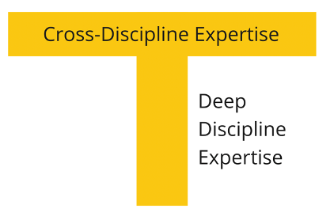

# Cross-functinal Team

## A problem we solve

We have described the product concept with the AI Canvas. Now, it is time to begin its development. The team members' skills list is already there. Here are our heroes:

* The Data Scientist (DS) will build the model and take care of the data.
* The Backend Engineer (BE) will handle the infrastructure and automate the model when it is ready.

You brief them and kick it off.

Two months later. BE finished with the infrastructure, but the model is not ready yet. BE isn't the guy the world wants idle. It just so happens that the neighbour project has an urgent task for him.

Suddenly, DS gets results, and they are exciting. The model is ready. But BE is still on that project and needs a bit more time. DS isn't the guy the world wants idle, either.

BE became available and began to automate the model. He has a few questions. The data is slightly out-of-date, and DS needs to redesign it. But he is still busy. No problem; there is a new project for BE already.

It's been a while. Finally, the project is complete. It's time to hand it over to the customer. He was very interested in starting the project. But now, he cooled off and has no time to accept the result.

Finally, you get the model to production. Unfortunately, it doesn't work as expected. Who will fix and refine it?

So, this kind of management causes specific problems:

* The project stays on hold while the participants finish their other tasks before switching to it.
* Switches delay the release even more because participants forget the context and spend time recalling it.
* Project relevance may drop to zero during implementation.
* Changes that lead to redundancies accumulate over time.
* Project participants may quit, and the project knowledge will go with them, too.
* No one is responsible for the final business result.

## Cross-Functional Team

Rather than split activities between departments, create a dedicated team with all the necessary skills. They will be responsible for the ultimate business result. We call such teams cross-functional.

!> A cross-functional team comprises people with different skill sets working towards a shared goal, implementing one plan, having mutual commitments, and sharing responsibility.

Distinguishing features of such a team:

* One goal. The team is responsible for the business outcome rather than building and deploying the model to production.
* The team has experts with all the skills necessary to achieve this goal.
* One plan (the backlog). The team designs the product and defines the roadmap together.
* Team members have mutual commitments. They support each other, share their workload, and review each others’ work.
* Everyone meets (for planning, stand-ups, retrospectives). The team regularly meets to sync their progress and refine the plan.
* The team is permanent. It exists for a long time, and its members are fully dedicated to it.

## T-Shape Professional

It’s easy to say. One team should be responsible for the result. But how will it work? Should it have both DS and BE? Will there be an adequate workload for both? For instance, what will BE do while DS is building a model?

Team members will be able to assist each other significantly if we remove artificial function separation between them.

Each team member, as experts in their field who know related areas well enough to help others, should be a T-shaped professional.

## Main Objections against Cross-Functional Teams

If you haven't seen an operating cross-functional team before, you may be puzzled. Your entire management experience should speak against it.

Here are the typical objections:

**A backend engineer is not qualified to build models.**

> Rather than a 100% role switch, we're talking about mutual assistance. What about helping DS to create a complex feature, write an auto-test, or help with infrastructure? If an ongoing DS task blocks others, any help will speed up the process and reduce the project duration.

**DS wouldn't want to do a backend engineer job.**

> Ask your team members if they are ready to help each other to reach their project goals faster. You will not encounter any resistance. People typically welcome teamwork. Even with no such experience, they will be ready to try it.

**They are mathematicians, and they came here to write code. They are not oriented towards business goals.**

> A common goal provides a sense of belonging to something greater. Teamwork ensures mutual support and helps combat impostor syndrome. Responsibility for the business outcome allows for greater decision-making autonomy. This drives team involvement and motivation.

**We have many ML projects. It’s unrealistic to assign each one a separate team.**

> We don't create teams around products; we pass products to product teams. A single stable cross-functional team can handle several ML projects. Cross-functionality enables such a team not merely to build and support a functioning model but to develop it, permanently improving its business results. A stable team secures long products' lifespan and high profitability.

**How can team members share the load?**

> Cross-functional team synchronization may not be that simple. It requires specific processes in place. We will consider Kanban in later chapters as one of the ways to organize a proper interaction in such a team.

## DS Team as a Service

Single-player work on a business task is a way to burn out. If you have conditions that make cross-functional teams inefficient, use dedicated Data Science teams—even if they only consist of DS. We call such teams "DS as a service“. This setup encourages data scientists to help each other, do the code review, and provide support when needed.

## When cross-functional teams are not efficient

Let's see when DS as a Service makes more sense than the cross-functional team.

* You just started hiring. Passing data scientists to the product team may not be the best idea. DS as a Service would allow fresh hires to gain some experience, realize where they are needed, and most importantly, elaborate general rules and DS culture. In this case, DS as a Service is a positive step towards cross-functional product teams.
* DS work is occasional, and the product team doesn't have many areas that DS can improve. In this case, DS can be part of the product team while developing ML service, which means tight involvement and participation in all the team meetings. So, other team members understand DS's role better and are ready to help to achieve more timely results.

## Cross-functional team benefits

A stable cross-functional team built around one or more products provides the following benefits:

* It is responsible for the business result.
* Team members are strongly motivated and involved.
* The team support and strengthen the product during its entire lifecycle.
* Close cooperation improves the team interaction, ensuring a better T2V (time to value) for the entire project duration.

## Team leadership

* The Product Manager/Product Owner is accountable for the business outcome in front of company management.
* The Process Lead is responsible for the team's efficiency. They facilitates meetings and solves dependency issues, coaching and mentoring other team members.
