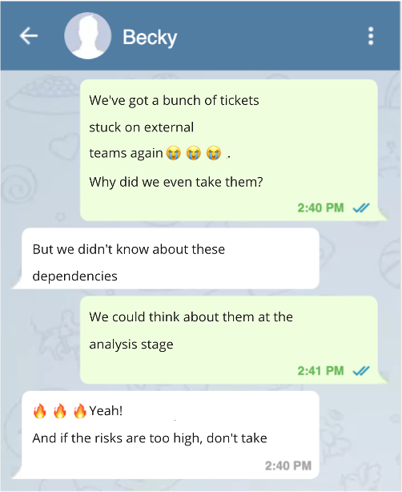
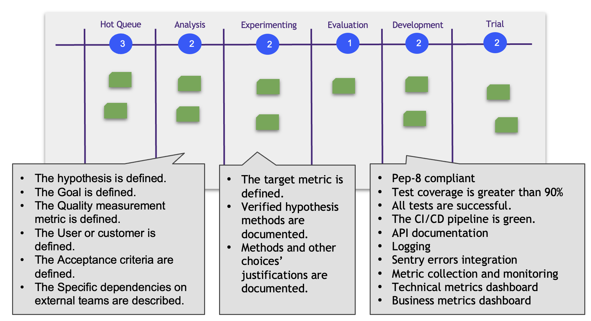

# Explicit Policies

You identify the process problem. And you develop a rule that facilitates solving it or at least minimizing the risk. For example, you decide to specify external teams' connections at the hypothesis analysis stage. That allows foreseeing the blockers and dealing with them in advance.

You can write such a rule as an Explicit Policy. Explicit Policy is a checklist answering the question: «Can we move the ticket to the next column?»

## Explicit Policies Examples

