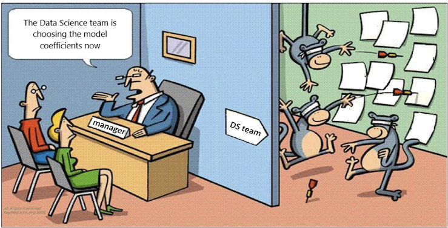
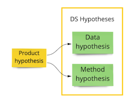
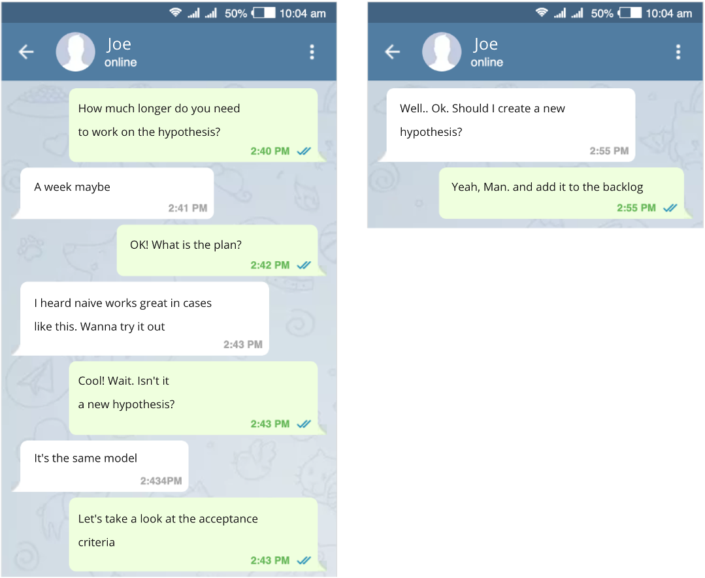

# Hypotheses

## A Problem We Solve

Joe is a Data Scientist. He has been working on a new model for a few days already. Joe stays up late and looks swamped. Probably he needs a task to be assigned, doesn't he?

Below are two tasks with the typical wording one might find in a task tracker:

?> Look into the dialog module of the chatbot.

?> Debug kNN model.

What's wrong with the statements?

* The assumption that the responsible person knows all the details. 
* The statement doesn't convey the business value.
* There are no criteria for success.
* It's unclear how to test them.
* It's unclear how to evaluate them.
* It's hard to say how urgent they are.
* The description is not informative for the rest of the team.
* The task is unclear for business and other stakeholders.

## Where it might lead

* Stakeholders and business customers see no value in the meetings since they don't understand the purpose beyond it all.
* Team members are busy bees. They encounter increasingly intriguing but not critical problems along the way. That delays timelines and makes situations unpredictable.
* A great workaround is obvious. But a stakeholder who could point it out is not involved in the context.
* Task reviews by other team members are cosmetic since they don't include enough details. At best, it may be a code review, but they can not evaluate an approach.

## Three Types of Hypotheses

Another way to describe tasks is to formulate tasks explicitly as hypotheses.

We will examine three types of hypotheses:

* **Product hypothesis**: An assumption that a specific change would generate value for a business.
* **Data hypothesis**: An assumption that additional data would improve a specific metric.
* **Method hypothesis**: An assumption that a specific method would improve a specific metric.

## Product Hypothesis

A product hypothesis usually breaks down into several data and method hypotheses.

To form a Product Hypothesis, answer four questions:

* What problem do we solve? (the problem)
* What will we change? (the solution)
* Who will be affected? (the customer)
* Which metric would measure the impact? (the metric)

Template:

?> We expect to **[solve the problem]** of **[the audience]** by **[making the changes]**, which would drive **[the metric to generate value]**.

Example:

?> We expect **to cut the costs** of **agents working with the mass-market segment** by **implementing automatic clients' classification**, which would **increase the share of satisfied clients per agent to 10%**.

Pay attention to the wording "we expect. " It informs a business customer and stakeholders that we are running an experiment rather than fulfilling an obligation.

A hypothesis formulation doesn't specify the way to reach the goal.

!> Projects are subject to product hypotheses, too.

We have described a project concept with AI Canvas before. It can be expressed as a product hypothesis.

Note that it matches the project concept from the chapter on AI Canvas.

## Data and Method Hypotheses

You and Joe have built the product hypothesis. It has a high business value and can be validated. However, the validation may take long: weeks or even months. That is hard to manage. So, split it into smaller hypotheses: no greater than one person/week each.

Template:

?> Using [data] with [method] will ensure [metric] to be [value].

Example:

?> Using clustered users' questions with a Linear Classification Model will ensure TOP5 answers suggestion accuracy to be 50% or more.

## DS Hypothesis Rules

* Each DS hypothesis describes how to achieve a goal stated in its parent Product Hypothesis.
* There are two types of DS hypotheses: data and method.
* Each data/method hypothesis focuses on a single improvement. Either we add new data or improve a method. One should avoid hypotheses affecting data and a method of the model simultaneously. Otherwise, it will be hard to decide what drives an improvement.
* From simple to complex is the best way to iterate through hypotheses. Establish a baseline with the simplest data and method and gradually move on to the most promising ones.

## Acceptance Criteria

Each complete hypothesis requires acceptance criteria. It's a requirements checklist one should fulfill to consider a particular hypothesis processing complete. 

The acceptance criteria list is a part of the preliminary analysis. It helps the team ensure the processes' quality and chart its path before the validation job begins.

### Example

?> Using clustered users' questions with Linear Classification Model will ensure TOP5 answers suggestion accuracy to be 50% or more.

- [ ] Question/answer pairs clustered
- [ ] Selected clusters number criteria
- [ ] Questions/answers dataset clustered to the select number of clusters
- [ ] Validation dataset metrics computed and added to the project
- [ ] The code review is done.
- [ ] The code is added to the repository.

## New Hypothesis

New hypothesis:

?> Using clustered users' questions with the Naive Bayes Model will ensure TOP5 answers suggestion accuracy will be 50% or more.

Joe works on a new hypothesis. He asks to shift the timeline by a week. Why the delay? He can't reach target metrics and wants to try another method. You look at the acceptance criteria and agree that this is a new method, implying a new method hypothesis. So, rather than pouncing on it, you can describe it and add it to the backlog.

Even for a moment, we don't concede that Joe is so into the new article that he completely abandoned the linear model. He is not that guy. But what if he missed something, and the linear model might work well? Joe should finish with the checklist:

* Add the code to the repository
* Compute all the metrics
* State all the findings
* Add the code to the repository
* Do the code review

And so on.

This will allow the team to discuss the new hypothesis, formulate Acceptance Criteria, and process it the right way.

## When you may benefit from hypothesis-based approach

* A hypothesis helps to focus on the result.
* Hypothesis-based work is easy to schedule and evaluate.
* Proper hypothesis processing allows one to articulate outcomes of the experiments clearly, reduce the number of errors, and maintain accurate documentation.
* Make the process transparent for all the stakeholders.
* Involve the whole team in generating ideas.
* The team can split one product hypothesis into several and work in parallel.

## When There is No Need for DS-hypotheses

* If the product hypothesis is small (less than a person/week), don't split it into several smaller ones.
* If data and method hypotheses don't require too much time to validate (a few hours or less), the team may decide to do them all at once.
