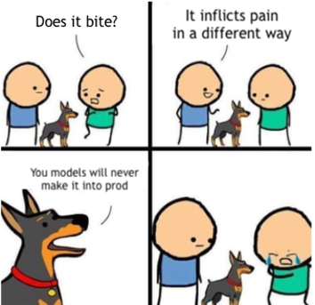

# Introduction

VentureBeat [states](https://venturebeat.com/2019/07/19/why-do-87-of-data-science-projects-never-make-it-into-production/) that 87% of DS projects never make it into production. [Other research supports this statistic](https://designingforanalytics.com/resources/failure-rates-for-analytics-bi-iot-and-big-data-projects-85-yikes/).

IT projects, on average, are faring better. According to Gartner, they fail 50% of the time, which means IT projects are at least getting into operation. The reasons for the failure include unachieved goals, budget overruns, or missed deadlines.

!> 87% of DS projects never make it into production

## Why do data projects fail?

This book explores the roadblocks causing AI projects to fail and how to improve their chances of success. Here are the roadblocks:  

* Stakeholders pursue different objectives
* Miscommunication between the business and team
* Insufficient process transparency
* Insufficient teamwork

The AI industry still has to gain the necessary project instruments, while its software-developing colleagues are almost there. Can we replicate their methods?  

Yes and no. While we can learn from Data Science’s approaches to project management, Data Science projects are not identical to AI projects. Copying their approaches may cause even more harm.

This book tailor-fits established Software Development approaches for Data Science projects and products.
