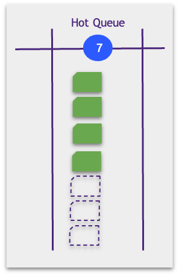

## Kanban Meetings

## Stand-Up Meeting, aka Kanban-Meeting

Stand-up is a daily meeting near the team kanban board.

Here are the rules of the meeting:

* Participants are a team plus external experts if necessary.
* Stand-up takes place daily, at the same time.
* The team explores tasks from right to left from top to bottom.
* The facilitator asks for each ticket, «what prevents from moving this work to the next column?».
* Each blocker gets a person in charge and a deadline.
* The focus is accelerating tasks advancement along with the board.
* Everyone takes tasks to move them to the next column by the next stand up.
* The team first focuses on the older tasks.

Try shorten the stand-up to 15-20 minutes. It might seem like a challenging task. Over time, you will learn to make it even faster:

* You might start discussing every ticket on your early stand-ups. Later, you will learn to focus on blockers only as your team experience grows.
* The team learns to work with a board outside the stand-up, identifying blockers, tagging statuses in comments, breaking down work into tasks, etc.
* The team interacts with each other ad-hoc, continuously, using stand-up as additional synchronization.
* At stand-up, the team members learn to share what is essential only.
* All necessary joint discussions happen outside of stand-up.

## Planning, aka Replenishment Meeting

These are the planning meeting rules:

* Participants are a team, stakeholders, and external experts.
* Participants place the most important backlog items in the Hot Queue.
* We can place as many tickets in the Hot Queue as we have available slots. In the picture, we have WIP = 7. There are four hypotheses in the Hot Queue, which means there are only three available slots for new tickets.

## Retrospective, aka Service Delivery Review

Regularly (usually once every two weeks or once a month), the team gathers for 1-1.5 hours for the performance review.

The retrospective has the main rule (Prime Directive) that Norman Kerth introduced:

!> "Regardless of what we discover, we understand and truly believe that everyone did the best job they could, given what they knew at the time, their skills and abilities, the resources available, and the situation at hand".

Should it turn into a flood of mutual recriminations, the meeting productivity will be close to zero. We're discussing how to change the system to fix the problems we found.

Here are some rules of retrospective:

* Retrospective is about the process efficiency and not the planning of a product.
* Retrospective results in about changing the way of work. The difference can be a new or removed board column(s), changing WIP limits or Explicit Policies, or additional board rules.
* Retrospective resolutions are experimental. We agree to alter the approach and discuss its efficiency in subsequent retrospections.

## Retrospective formats

There are many possible formats. The most convenient and straightforward is the following.

Break the board into four parts:

* Pros. What worked and what we want to keep in the process.
* Cons. What didn't work (posed risks, affected performance, etc.)
* Ideas. What can be improved to solve these issues?
* Plan. What will we change in the process?

Then:

* The facilitator reads the results of the last retrospective aloud.
* Participants move through all the four quadrants on the board, placing the sticky notes with ideas.

As a result, the team gets a plan of to-do items to improve the process.
