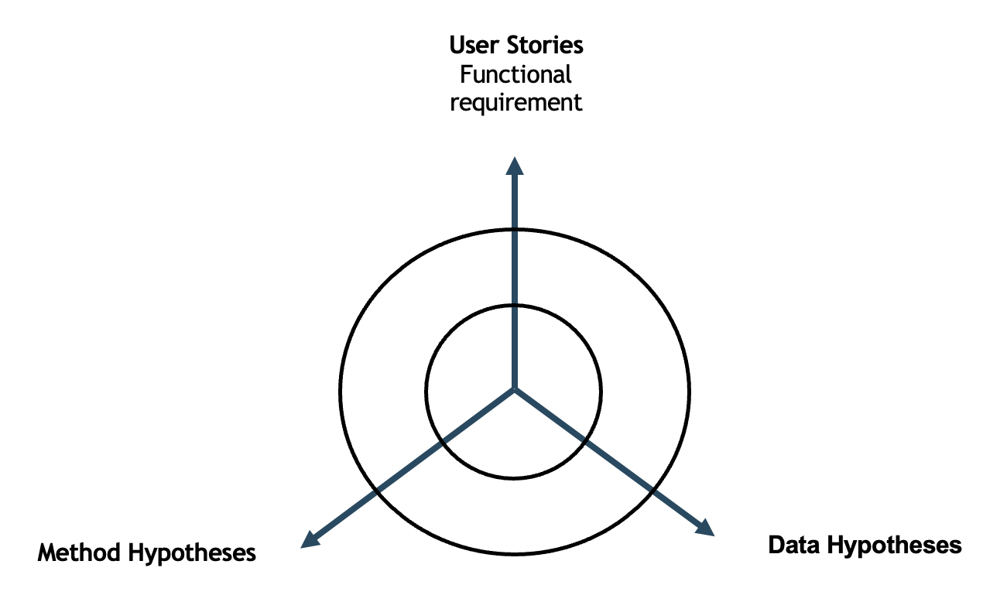
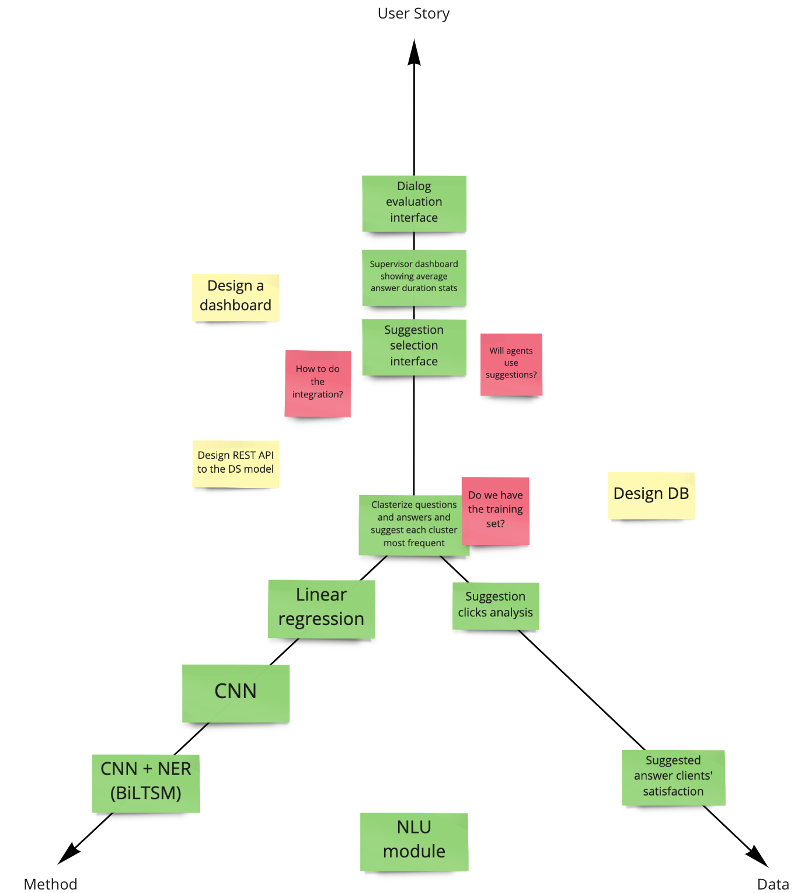
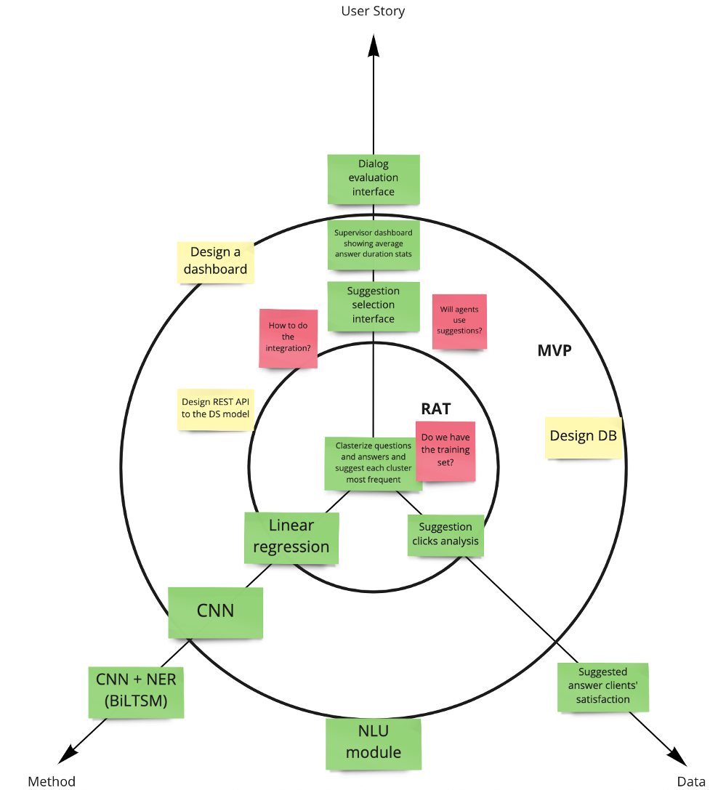

# "Mercedes" Decomposition

In the Story Map chapter, we discussed planning a software product as a whole, given that ML is an integral part. This chapter covers planning ML product itself. Consider the backlog of an ML project a big product hypothesis.

## Why planning is essential

Some argue that research project plans are pointless. It doesn't support the idea of planning when engineers prepare a plan and see how new data emerge and make it meaningless.

Let us see why planning is important and discuss how to make it work.

## Proper Risk Management

Several months to create a model may not be a big deal for a data scientist. For a business, it is. The model should undergo many stages to demonstrate its real efficiency, including integration with other products, production deployment, and even real users' evaluation.

Imagine you put significant effort into the model. Finally, you push it into production and discover that training data crucial for the model functioning is not available there, rendering it useless.

Perhaps you even launched the model, and its A/B test demonstrates decent results, but the compliance review disallows its usage due to legal issues.

Considering that in advance, you could avoid this risk and put your time to better use.

A plan should highlight the risks and help manage them. 

## The whole team should participate in the planning.

Often, the DS Lead is the one who does the planning. As the most experienced one, he sits, thinks hard, creates the plan, splits it into tasks, and distributes them, among others. This method is straightforward, but it loses against team planning.

Team planning improves decision quality and ensures all the participants share the same goals and understanding of methods, limitations, and risks.

## Plan Requirements

What should an ideal plan look like? Here are the criteria:

!> The plan should be incremental and iterative.

It starts from the approach that is most straightforward and progresses towards more complex ones. There are many reasons why some teams don’t do that. It can be a passion for creating something exciting rather than ordinary or a strong recommendation from a business customer.

Still, starting with a straightforward model is the best practice because it:

1. Establishes a baseline for all future improvements.
2. Enables getting all the stakeholders' feedback.
3. Implements the key integrations.

These three components reveal a significant part of all the risks at an earlier stage and allow you to deal with them at a minimal cost.

!> The plan must be flexible.

It should be able to accommodate new information as it emerges.

!> The plan should focus on validation

It should start the project with the riskiest hypotheses capable of killing the project if it fails.

## Mercedes Method Planning

Let’s talk about the ML-planning approach we call the “Mercedes” method. It allows you to create a sequential, incremental plan that considers all the critical risks.

Mercedes method planning consists of three steps:

1. Hypotheses brainstorming
2. Proof of Concept/MVP
3. The analysis of risk checklists

Key participants:

* DS team
* Domain experts

Other stakeholders may join as necessary:

* Related teams
* Business customers

## Planning Preparation

Draw three axes, as shown in the figure below:

## Step 1. Hypothesis Brainstorming

Place the following sticky notes along the three axes together with your team:

* Method Hypothesis. This axis accommodates method hypotheses—from simple to complex. For instance, heuristics may go first, then linear, and finally, neural networks.
* Data Hypothesis. The next is the data hypotheses axis, starting from the data available right away, then adding new sources in ascending order of data acquisition complexity.
* User Stories stay along the vertical axes. These parts of the project are directly related to software development necessary for the final result or functionality.
* Questions. You will raise several questions in the process. For instance, it may not be clear which data is at your disposal already and which would require additional integration. Add a sticker of a different color with that question.
* Technical Tasks also go along the vertical line. They may encompass infrastructure and architecture, for example, model to backend integration, HDFS deployment, model launching infrastructure.

This is how your result may appear:

## Step #2. Proof of Concept/MVP

You may generate many hypotheses in the previous step.

We remember that our top priority is the fastest product hypotheses validation. We need to decide what has the highest priority and what does not.

To do that visually, let's add two concentric circles and split the diagram into three areas, as the figure shows:

* RAT (Riskiest Assumption Test). The riskiest hypothesis we can validate and kill the product before deploying it into production.
* MVP (Minimum Viable Product). Minimal product, which we can validate with end-users.
* SCALE. Additional improvements we can postpone to later stages.

Discuss and redistribute your hypotheses between these three categories. Do your best to minimize RAT and MVP. The closer the hypothesis is to the center, the higher its priority.

## Step #3. The Analysis of Risk Checklists

Risk management means we identify and mitigate risks we would have to deal with later, at the early stages of the project.
To help DS teams, the LeanDS community collected a set of typical questions to identify these risks.

Examine the list with your team and try to answer each one using the following options:

* You have an answer. Move on.
* The question is irrelevant. Move on.
* The question is relevant, and the answer is not clear. Place a sticky note on it.

