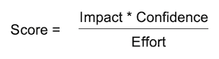
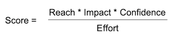
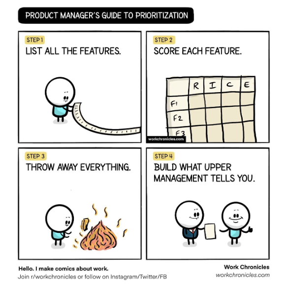

# ICE/RICE Prioritization

## Where to Begin?

The backlog is full of fascinating product hypotheses. Which one should you pick? The most valuable, of course. But how can you decide which is the most lucrative?

What about asking the business team?

You come to Annie, the most indispensable manager. She casts a thorough gaze at a backlog and immediately picks the best hypothesis. Let's assume she is right, and it is the most profitable item, indeed. Are you good to go?

Actually, no. To make an informed decision, you must consider costs.

Let's assume:

* the best hypothesis can bring $1 million and requires nine months.
* the following three can get $0.5 million and require three months each.

You can do three simple ones in nine months and earn $1.5 million instead of one with $1 million. Let's not forget that we are talking about hypotheses with limited chances for success. These chances should also be part of the equation.

## ICE prioritization method

The idea is to evaluate each hypothesis with the formula:

The higher the score, the higher the priority.

Let's examine each part separately.

## Impact

Impact measures outcome from a business perspective.

Often, we can't calculate it in dollars because:

* We don't have enough data.
* A hypothesis doesn't inherently generate value but paves the way to another.
* A business value may be indirect, like new markets penetration or meeting some government regulatory requirements.

We can, however, easily estimate the value of one hypothesis over another.

Let's use relative units instead of money. Most of the time, it's a simple set of categories with relative values, like in the table below.

|     Category    |     Impact     (value points)    |
|-----------------|----------------------------------|
|     Massive     |                 3                |
|     High        |                 2                |
|     Medium      |                 1                |
|     Low         |                0.5               |
|     Very low    |                0.25              |

Here is how you proceed:

1. Pick a hypothesis with an average impact to set the baseline. It is "Medium" with impact 1.
2. Estimate the rest relative to the baseline you set. If another hypothesis is twice as valuable, its Impact is 2. If it is two times less valuable, its Impact is 0.5. A high-value hypothesis may reach 3, and so on.

## Effort

Effort estimates how much work a hypothesis would require.

It may be hard to estimate exact labor costs for many reasons:

* Insufficient data exist for precise estimation.
* We don't know what difficulties we would face along the way.
* Team member perspectives may vary significantly. For instance, junior and seasoned Data Scientist estimates may differ several times.

As with Impact, it boils down to relative units, too. Some books call them Story Points.

Many prefer progressive scales based on Fibonacci or geometric series to avoid excessive discussions, like 5 points or 6.

The steps are the same as Impact. Pick a baseline hypothesis that is straightforward to implement and assign it one story point. If another seems twice as hard, make it a 2. And so on.

## Confidence

Confidence estimates the chance that the hypothesis is valid and its implementation will deliver the expected value. It's convenient to measure it in percents since it can't exceed 100. Use a fixed set of categories for different levels of Confidence.

|     Category    |     Confidence    |
|-----------------|-------------------|
|     High        |          100%     |
|     Medium      |           80%     |
|     Low         |           50%     |
|     Very low    |           10%     |

## Hypotheses Prioritization Session

Every stakeholder and team member may have a different opinion about Confidence, Efforts, and Impact for each item in the backlog. A joint session will help to get everyone on the same page. There are many ways to do that. Planning Poker is one of the interesting ones:

Let's see how it might work with Efforts.

1. First, players pick the baseline hypothesis (ideally, the most simplistic to implement). Assign 1 Story Point to it.
2. Everyone gets the deck with a Fibonacci series.
3. A host announces the following hypothesis.
4. Players estimate how much the hypothesis differs from the base one and place an appropriate card face-down on the table.
5. When everyone is ready, the host turns the cards over
6. Those who picked a maximum and minimum explain their perspective.
7. Players repeat steps 4-6 until all the estimates are close enough.
8. The host writes down the final estimate and starts the text.

Impact and Confidence are processed similarly. Then, the team calculates Scores and gets the final priorities estimations.

## RICE Score

It may be beneficial to split Impact into a product of Reach and Impact, which results in the following formula:

**Reach** — estimates how many times the hypothesis effect would take place. Depending on the context, one can measure it in users, orders, transactions, etc.

**Impact** — estimates business value brought by a single point of Reach.

Let's say you sell Data Products to banks. Then Impact is an estimate of the influence of the hypothesis on a particular bank. For example, one hypothesis may be essential, and its Impact = 3. The Impact of another hypothesis is 1. However, the market (proportional to the number of banks that can potentially be interested in the related data product) for the first hypothesis is large and is equal to 3, and for the other hypothesis, the market is three times less and equal to 1.

## Prioritization Hints

* Invite the DS team. Joint discussions about Impact and Reach with the stakeholders will ensure in-depth understanding, inspire, and facilitate better decisions along the way.
* The DS team may resist participating. Explain that the prioritization makes no sense without a proper Effort estimation, and their presence is crucial.
* You may still discover later that the prioritization or a particular score was incorrect. It's OK. Although this process isn't perfect, it maximizes the chances of success in the long run.
* Only hands-on implementers may participate in Effort estimation. Business stakeholders usually lowball an estimate.

## Prioritization Approach Development

The approach to prioritization in your company will develop with time. Here are the few potential directions for that:

* Split the Confidence into Confidence from the business perspective and technical feasibility.
* Standardize the Confidence scale with a set of criteria. You might have factors that increase the Confidence of a hypothesis: confirmed similar cases in your country, successful A/B tests, or a business case.
* A similar scale works with Impact.

Sometimes, senior staff may try to intervene and devalue the teamwork by altering the priorities you chose. Invite them to the next prioritization session. Rather than solely deciding on specific hypotheses' Impact or Confidence, they will have to sell their ideas to the team.

## ICE/RICE benefits

* It maximizes business revenue.
* It rules out irrelevant and unrealistic projects.
* It secures stakeholders' support for the priorities you choose.

## When you don't need ICE/RICE

ICE/RICE is geared towards product hypotheses only. Data and method hypotheses have no value on their own and require a different approach described in the chapter on product hypotheses decomposition. If your team has only a few product hypotheses, let's say 1-3, the full-fledged prioritization may be overkill.

## When you may benefit from ICE/RICE

To prioritize, you need a lot of hypotheses. Usually, the team works on a small set of product hypotheses since they take a very long time to implement. However, as soon as the model gets into production, its improvement is not so laborious, and the number of hypotheses in the backlog can become significant. The team can then use the ICE method to prioritize.

One can use ICE at the level of the entire organization. You can have hundreds of ideas for applying ML in your company, and ICE would allow you to select the best ideas and hand them over to the data teams.

!> The ICE Approach has been coined by Sean Ellis, author of the term Growth Hacking.
