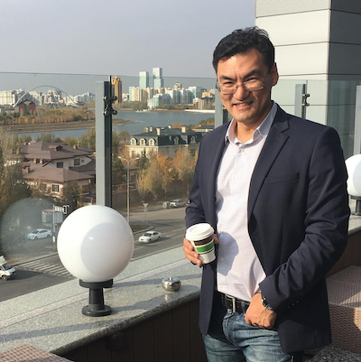

# Об авторе

Привет!

Спасибо, что читаете эту книгу!

Меня зовут Асхат Уразбаев. Я - основатель сообщества LeanDS и один из авторов подхода LeanDS.

Я окончил МФТИ в 2000 году и прошел достаточно классическую карьеру от разработчика до руководителя проектов, руководил тестированием. В компании Luxoft я поучаствовал в  Agile проектах в роли владельца продукта и скрам-мастера. С 2006 года я стал аджайл-коучем.

В 2008 году вместе с партнером я основал компанию ScrumTrek и с тех пор тренирую и консультирую компании по гибким подходам. Моя работа — помогать компаниям выстраивать более эффективные подходы к работе.

Так случилось, что несколько лет назад я оказался руководителем проектного офиса в компании, занимающейся  консалтингом в Data Science. Оказалось, что «классические» гибкие подходы к таким проектам не работают. Нам пришлось методом проб и ошибок придумывать работающие практики. Они легли в основу этого подхода LeanDS, описанного в этой книге.

https://www.linkedin.com/in/urazbaev/
