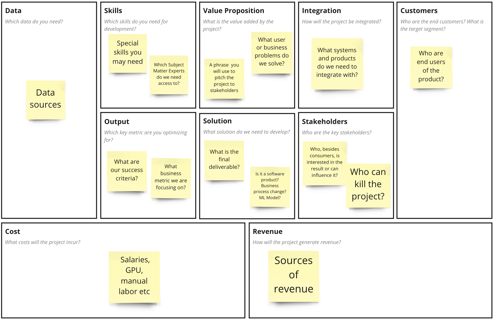
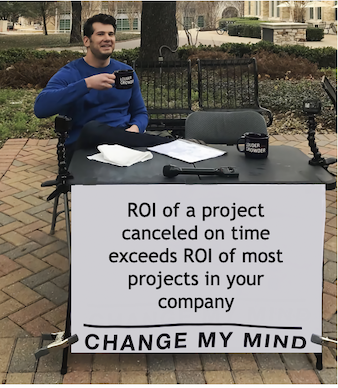

# AI Canvas

## Какую проблему решаем

Вы лидер DS-команды. Вас в коридоре поймал за пуговицу кто-то из бизнеса и начал рассказывать вам про модель, которую надо сделать.

Вот в чем идея: У компании есть чат. Сотрудники call-центра (агенты) отвечают на вопросы клиентов. Было бы здорово автоматизировать этот процесс: пусть на вопросы клиентов отвечает бот!

Все понятно! Приступаем к работе. С чего начнем? Пожалуй, надо посмотреть, какие данные есть по существующим диалогам с клиентами и исследовать SOTA по этой теме...

Стоп! Приступать к работе еще рано. А действительно, что может пойти не так?

Да что угодно! Вашу модель не готовы будут интегрировать команда CRM, потенциальная экономия от использования модели может не окупить трудозатраты, директор call-центра откажется вносить изменения в работу подразделения, бизнес может иметь сильно завышенные представления о результатах работы модели и откажется принимать результаты и много что еще. Все эти не случившиеся пока проблемы (мы будем называть их рисками) могут привести к провалу проекта.

Приступать к работе рано. Нужно синхронизировать ожидания всех участников проекта. Если мы обнаружим проблему вроде перечисленных выше, мы сможем ее обсудить и решить. Если вдруг она нерешаема, мы можем убить проект до его начала и сэкономить несколько месяцев работы квалифицированных и дорогих специалистов.

Давайте обсудим все наши вводные предположения и ожидания! Для проведения такого совещания бы воспользуемся AI Canvas.

!> AI Canvas — одностраничный шаблон концепции (vision) AI проекта, документирующий его ключевые предположения

## AI Canvas Structure

AI Canvas состоит из 10 блоков с ключевыми вопросами, на которые нужно ответить перед стартом проекта.

В течении совещания его нужно заполнить стикерами-идеями по проекту.

Цель — обеспечить непротиворечивость и целостность концепции проекта

## Как использовать AI Canvas

Вы собираете совещание со всеми заинтересованными лицами:

* Представители бизнеса (заказчики)
* Члены вашей команды
* Специалисты предметной области
* Представители смежных команд и служб

Общее правило такое: стараемся вовлечь тех, кто может дать обратную связь по предстоящему проекту.

## Как заполнять канвас

* Лучше начать заполнять канвас с блоков Customer и Value Proposition
* Помните, что это просто идеи, любой участник может повесить стикер!
* Не застревайте долго на обсуждении, если нет информации. Не знаете — повесьте стикер с вопросом. Я предпочитаю выделять такие вопросы другим цветом
* Проверяйте сами и просите участников проверить, насколько непротиворечивой получилась итоговая картинка.
* Канвас может не получиться с первого раза. Дайте себе домашнее задание ответить на вопросы и запланируйте отдельное совещание после их проработки
* Не удалось затащить на совещание важного стейкхолдера? Не беда, до него можно дойти позже и валидировать результат.
* Бывает так, что по итогам заполнения канваса выясняется что проект даже теоретически не имеет смысл делать. В этом случае мы можем принять решение о его остановке или заморозке. Поздравим друг друга, мы сэкономили кучу времени для других проектов и не стали делать демотивирующую работу «в стол»

№№ Пример заполнения канваса

Итак, вы провели совещание со всеми заинтересованными лицами. По итогам совещания выяснилось несколько интересных фактов:

* Представители бизнеса считали, что можно автоматизировать 80% ответов на вопросы. Ваша реалистичная оценка — 15% в ближайший год
* COO компании категорически против, чтобы автоматизировать общение с сегментом Effluent — пользователями на дорогом тарифе. Наш фокус — массовый сегмент
* Массовый сегмент сейчас обслуживает 15 человек и реально их снизить на 2-3. Кажется, нет смысла затевать проект ради такой экономии?
* COO очень интересовался возможностью ускорить ответы пользователям. Это могло бы помочь снизить отток пользователей
* Ходят слухи, что команда CRM сейчас переходит на новую систему и не готово к интеграции. И на совещание они не пришли, потому что им некогда.

Вы наметили три вопроса на проработку и договорились встретится еще раз через неделю.

Что произошло? Мы выявили ключевые риски проекта, без решения которых не имеет смысла серьезно вкладываться в техническую часть работы.

## Когда нужно использовать канвас

Внутри компании стартует новый проект или продукт и перед стартом нужно синхронизировать ожидания участников
Вы — консультант по AI и перед стартом работы с заказчиком нужно договорится о критериях успеха проекта

## Когда не нужно использовать канвас

Проект небольшой (скажем, доработка уже существующей модели) и нет смысла собирать отдельное совещание по каждой такой задаче. В этом случае вполне достаточно просто сформулировать продуктовую гипотезу

## Преимущества использования AI Canvas

* Канвас позволяет рано выявить завышенные ожидания со стороны бизнеса
* Не делаем проекты, которые даже теоретически не имеет смысл затевать
* Канвас позволяет совместно двигаться к согласованной бизнес цели
* Все члены команды понимают, какой результат может получиться с точки зрения бизнеса и сфокусированы на ней

## Преимущества использования AI Canvas по сравнению с ТЗ

Почему бы вместо канваса не написать традиционный документ — техническое задание для проекта? Пусть аналитик его напишет и со всеми согласует. Зачем все эти сложности и лишние встречи?

* Создание концепции проекта — брейншторминг и часто требует сфокусированной креативной совместной работы
* О концепции сложного проекта можно договорится за 1-2 встречи (скажем, одна-две недели), в то время как согласовывать сложный документ гораздо дольше
* У разных стейкхолдеров проекта могут оказаться противоречивые мнения, так что встреча в любом случае понадобится
* Формальное ТЗ при необходимости можно написать по итогам согласования AI Canvas

?> Идея использовать канвасы вместо документов изначально популяризована Алексом Остервальдером. Он использовал Business Model Canvas для создания бизнес-моделей организации. Изначально AI Project Canvas предложен и описан Jan Zawadsky в этой статье: https://towardsdatascience.com/introducing-the-ai-project-canvas-e88e29eb7024
