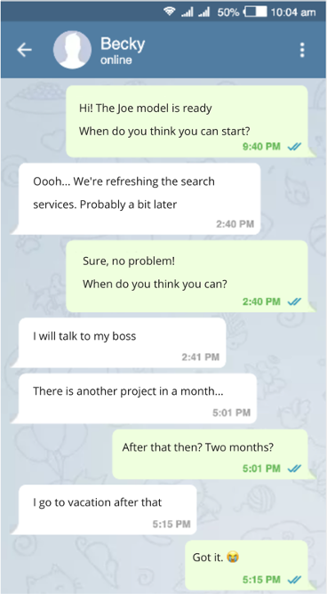
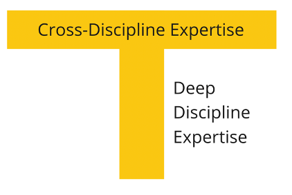

# Кроссфункциональная команда

## Какую проблему решаем

Концепция продукта описана при помощи AI Project Canvas. Теперь пора стартовать разработку нового продукта. Хорошо, что в канвасе перечислены навыки членов команды. Вот кто нам понадобится:

* Data Scientist (DS) будет строить модель и заниматься данными
* Backend Engineer (BE) будет заниматься инфраструктурой и автоматизировать модель, как только она будет готова

Вы ставите задачу каждому из них.

Прошло пару месяцев. BE закончил с инфраструктурой, но модель пока не готова. Не простаивать же ему? Тут в соседнем проекте как раз есть срочная работа, пусть ей пока займется.

Внезапно DS получает хорошие результаты! Модель готова. Но наш BE уже на другом проекте и у него свои обязательства. Не простаивать же DS?

BE освободился и приступил к автоматизации модели. У него есть несколько вопросов к DS — данные успели немного устареть и модель нужно переделать, но DS пока на другом проекте и заняться этим не может. Что ж! Пока можно BE переключить на новый проект.

Проходит какое-то время. Наконец проект завершен. Пора передавать его заказчику. Он был очень заинтересован в начале проекта, но ближе к концу охладел и у него нет времени принять результат.

И все-таки удается довести модель до прода. К сожалению, она не показывает нужных бизнес-результатов. Кто будет отвечать за исправление и доработку?

Итак, такое разделение работ неэффективно и приводит к следующим проблемам:

* Постоянные переключения между проектами приводят к задержке реализации
* Удлинение сроков проекта приводит к тому, что участники успевают основательно забыть контекст проекта и тратят время на то, чтобы вспомнить его
* За время реализации актуальность проекта может упасть до нуля
* За время проекта успевают накопиться изменения, которые приводят к лишним переделкам
* Участники проекта могут уйти из компании или подразделения и вместе с ними уйдут знания по проекту
* Никто из команды не отвечает за итоговый бизнес-результат

## Кросс-функциональная команда

Вместо разделения фронта работ по участникам или по подкомандам, давайте создадим единую команду, отвечающую за конечный бизнес-результат. В нее должны войти все компетенции, необходимые для достижения этого результата. Такая команда называется кросс-функциональной.

?> Кросс-функциональная команда — группа людей с различной функциональной экспертизой, работающая на одну общую цель, с единым планом, имеющая взаимные обязательства и чувствующая ответственность по отношению друг другу

Вот свойства такой команды:

* Общая цель. Команда несет ответственность за достижение бизнес-результата, а не создание модели и вывод в прод
* В команду (по возможности) включаются специалисты со всей экспертизой, необходимой для достижения цели
* Единый план (бэклог). Команда совместно определяет способ достижения этой цели: проектирует итоговый продукт и планирует работу
* Все члены команды имеют взаимные обязательства. Это означает, что они помогают друг другу, обмениваются работой и проводят ревью результатов работы друг друга
* Общие встречи (планирования, стендапы, ретроспективы). Команда регулярно встречается и синхронизирует работу и придумывает способы ее улучшить
* Стабильный состав. Команда формируется на длительный срок, все участники команды выделены в нее на 100%.

## T-shape professional

Легко сказать — единая команда, которая отвечает за результат, но как это будет работать? Если в одной команде окажутся и DS и BE, хватит ли каждому работы? Чем будет заниматься BE, пока DS будет делать модель?

Члены команды смогут эффективно друг другу помогать, если мы уберем искусственные функциональные барьеры между ними.

Каждый участник команды должен быть T-shaped professional: глубоко разбираться в своей области и достаточно хорошо в смежных областях, чтобы суметь помочь другим членам команды.

## Основные возражения против кросс-функциональности команд

Если вы до этого не видели, как работает такая кросс-функциональная команда, вы, наверное, серьезно обеспокоены. Весь ваш менеджерский опыт говорит, что такая конструкция в целом нежизнеспособна.

Давайте рассмотрим несколько типичных возражений:

**Backend Engineer не сможет сделать модель**

> Речь не идет о том, чтобы полностью на сто процентов поменяться работой. Мы говорим о возможности взаимопомощи. Сможет ли BE помочь DS сгенерировать какой-то замороченный признак (фичу)? Сделать автотест? Помочь с настройкой инфраструктуры? Если DS является узким звеном процесса, то любая помощь со стороны других инженеров сильно ускоряет общий процесс разработки и уменьшает сроки проекта.

**DS не захочет делать работу Backend Engineer**

> Просто спросите ваших сотрудников, готовы ли они помогать друг другу, чтобы быстрее добиться целей проекта. Никаких проблем вы не увидите. Люди, как минимум, не против командной работы и если даже у них не было похожего опыта, вполне готовы попробовать.

**Они математики / пришли писать код, и не мотивированы добиваться каких-то там бизнес-результатов**

> Наличие общей цели дает им чувство сопричастности к чему-то большему. Командная работа обеспечивает дружескую поддержку и помогает против синдрома самозванца. Ответственность за бизнес-результат увеличивает автономность в принятии решений, ведь теперь инженер свободен в выборе способа достижения цели. Все это приводит к увеличению мотивированности и вовлеченности членов команды.

**У нас много ML-продуктов. Нам просто не набрать столько команд!**

> Разница в том, что мы не формируем команды вокруг продуктов, а передаем продукты командам. Одна стабильная кросс-функциональная ML команда может отвечать за несколько ML-продуктов. Благодаря кросс-функциональности такая команда отвечает не просто за функционирование модели, но и за то, что она приносит нужный бизнес-результат, то есть за создание, поддержку и развитие модели. Стабильный состав команды обеспечивает долгий срок жизни продуктам.

**Как именно члены команды смогут обмениваться работами?**

> Действительно, синхронизация работы кросс-функциональной команды — дело не тривиальное. Нужен процесс, который позволит команде делать это эффективно. В более поздних главах мы рассмотрим Канбан, как один из способов организовывать взаимодействие в такой команде.

## Команда DS as a Service

Одиночная работа сайентиста над бизнес-задачей — путь к выгоранию. Даже если есть предпосылки к отказу от кросс-функциональной команды, я очень рекомендую создавать выделенные DS-команды, даже если они будут состоять исключительно из DS. Мы называем такие команды DS as a Service. Сайентисты в команде смогут помогать друг другу, делать ревью кода, поддерживать в сложных ситуациях.

## Когда использовать кросс-функциональные команды не эффективно

Давайте посмотрим ситуации когда использование кросс-функциональных команд невозможно или неэффективно и имеет смысл создавать команды DS as a Service.

* Вы только набираете сайентистов в компанию. Возможно, сразу передать сайентиста в продуктовую команду не лучшая идея. Создание команды DS as a Service позволит команде набраться экспертизы, понять, где есть потребность в их работе, а главное, выработать общие правила и общую DS-культуру. В этом случае команда DS as a Service является переходной к появлению кросс-функциональных продуктовых команд.
* Работа DS является совсем эпизодической и в продуктовой команде не нужно вовлечение со стороны DS на большое количество времени. В этом случае можно привлекать DS в продуктовые команды на то время, пока разрабатывается ML-сервис. При этом DS точно также посещает мероприятия команды, к которой он присоединяется. Это позволяет другим членам команды понимать, чем он занимается и оперативно помогать для того, чтобы быстрее получить бизнес-результат.

## Преимущества кросс-функциональной продуктовой команды

Итак, мы считаем, что кросс-функциональная команда стабильного состава, сформированная вокруг одного или нескольких ML-продуктов — эффективный способ увеличить эффективность:

* Команда отвечает за бизнес-результат
* Члены команды мотивированны и вовлечены
* Команды несут ответственность за ML-продукты на протяжении всего их жизненного цикла
* Командное взаимодействие обеспечивает лучший T2V (time to value) за счет плотного взаимодействия в течении проекта

## Лидерские роли в команде

* Product Manager/Product Owner. Несет ответственность (accountable) за бизнес-результат перед заинтересованными лицами.
* Process Lead. Отвечает за эффективную работу команды. Фасилитирует (проводит) встречи, решает проблемы с зависимостями, является коучем и ментором для других членов команды.
