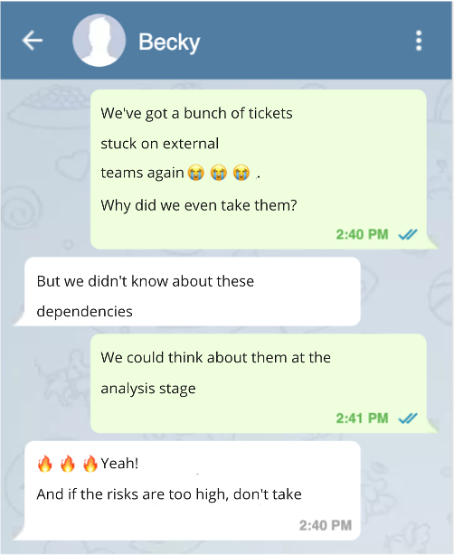

# Явные политики (Explicit Policies)

Вы находите проблему в процессе и придумываете правило, которое позволяет эту проблему решить или хотя бы минимизировать.

Например, вы решаете указывать зависимости от внешних команд на этапе анализа гипотезы. Это позволит видеть риски получить блокер заранее и решить, что с ним делать.

Такие правила удобнее всего записывать в виде Explicit Policy (Явных политик).

!> Explicit Policy —  чек-лист со списком правил, отвечающих на вопрос «можно ли перенести тикет в следующую колонку».

## Пример Explicit Policies

