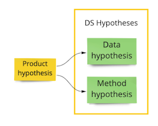
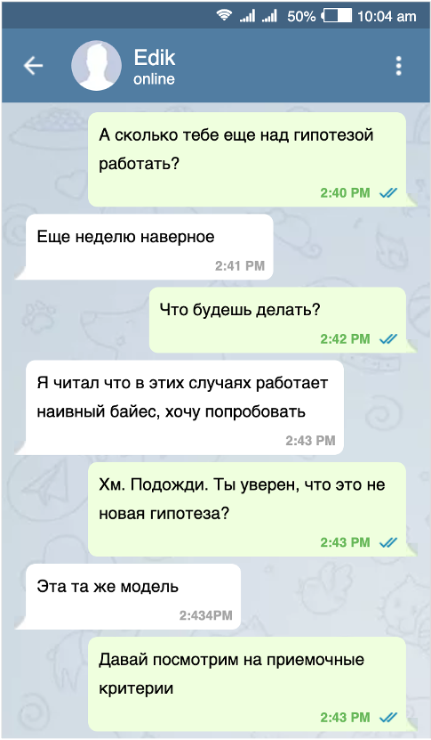

# Гипотезы

## Какую проблему решаем

Сайентист Эдик уже неделю занимается новой моделью. Он засиживается допоздна и в целом выглядит очень занятым. «Надо бы ему задачу поставить» — думаете вы.

Давайте поговорим о том, как должны выглядеть задачи для сайентистов.

На примере снизу две типичных задачи. Примерно в такой формулировке их часто можно найти в тасктрекере.

?> Исследовать диалоговые системы для чатбота

?> Debug kNN model.

## Cвойства традиционной постановки

* Предполагается, что исполнитель уже в курсе всех деталей
* Из формулировки задачи неясна ее бизнес ценность
* Из формулировки задачи неясны критерии ее окончания
* Задачу невозможно протестировать
* Задачу невозможно оценить
* Задачу невозможно приоритизировать
* Задача непонятна остальной команде
* Задача непонятна бизнесу и заинтересованным лицам

## К каким проблемам может привести традиционная постановка задач

* Встречи с командой непрозрачны для заинтересованных лиц и заказчиков. Они не понимают, чем занимаются члены команды.
* Члены команды закапываются в задачи. На пути решения они сталкиваются с новыми и новыми проблемами, увлекаются интересными, но неважными направлениями работ и в итоге задача может занять неограниченное время
* Иногда вместо решения проблемы «в лоб» заказчик или коллега могли бы предложить простой workaround, но из-за непрозрачности постановки это невозможно
* Ревью другим членом команды поверхностное, так как деталей постановки он не знает. В лучшем случае, другой член команды может обеспечить ревью качества кода, но не способа решения самой задачи

## Три типа гипотез

Гораздо более эффективный способ ставить задачи — явным образом формулировать их в виде гипотез.

Мы рассмотрим три типа гипотез.

* **Продуктовая гипотеза**. Предположение, что определенное изменение принесет ценность для клиента или бизнеса
* **Дата-гипотеза**. Предположение, что дополнительные данные улучшат метрику
* **Метод-гипотеза**. Предположение, что использование определенного метода улучшит метрику

## Продуктовая гипотеза

Продуктовая гипотеза разбивается (декомпозируется) на одну или несколько дата- и метод- гипотез.

Для того, чтобы сформулировать продуктовую гипотезу, ответьте на 4 вопроса:

* Проблема. Какую проблему пользователя или бизнеса мы решаем?
* Решение. Какое изменение мы хотим сделать?
* На кого повлияет изменение?
* Метрика. Какой метрикой мы измерим результат?

Шаблон:

?> Мы полагаем, что **[решим проблему]** для **[аудитории]**. Для этого мы **[сделаем изменения]**. Мы окажемся правы, если **[получим метрику]**

Пример:

?> Мы полагаем, что **[снизим затраты на агентов]**, **[обслуживающих массовый сегмент]**. Для этого мы **[автоматически классифицируем клиентов]**. Мы окажемся правы, если **[увеличим количество клиентов, обслуживаемых одним агентом, которые остались довольны ответом агента на 10%]**

Обратите внимание на словосочетание «мы полагаем». Оно явным образом говорит заказчику и всем заинтересованным лицам, что гипотеза не является обязательством, а процесс поставки ценности носит экспериментальный характер.

В формулировке продуктовой гипотезы мы не упоминаем способ достижения нашей цели.

?> Проекты это тоже продуктовые гипотезы

Ранее мы использовали AI Project Canvas для того, чтобы описать концепцию проекта. Ее  можно коротко описать в виде продуктовой гипотезы.

Обратите внимание, что гипотеза из примера выше соответствует концепции проекта из главы об AI Project Canvas.

## Формулирование дата- и метод- гипотез

Совместно с Эдиком вы сформулировали продуктовую гипотезу. Она имеет бизнес ценность, понятна заказчикам и команде, ее можно экспериментально валидировать. Есть одна маленькая проблема — проверка гипотезы займет слишком много времени: возможно, недели или даже месяцы работы.

Нужно уметь разбивать такую большую работу на относительно небольшие гипотезы не более человеко-недели по трудозатратам. Тогда прогресс будет понятен и прозрачен.

Шаблон DS-гипотезы:

?> Мы полагаем, что **[используя данные]** и **[метод обучения]** мы получим **[метрику]** не менее **[значения]**

Пример DS-гипотезы:

?> Мы полагаем, что на **кластеризованных вопросах пользователя и ответах агента** мы можем **построить линейную модель классификации для выбора подсказки**. Это позволит получить **Top 5 Accuracy не менее 50%**

## Правила создания DS-гипотезы

* Каждая DS-гипотеза связана со своей родительской продуктовой гипотезой. Они описывают предполагаемый способ достижения цели, указанной в этой продуктовой гипотезе
* DS гипотезы бывают двух типов: дата- и метод- гипотезы
* Каждая дата/метод гипотеза содержит атомарное улучшение модели. Мы либо добавляем новые данные, либо улучшаем метод. * * Нужно стараться избегать ситуации, когда мы одновременно улучшаем данные и метод. Тогда если даже мы получим улучшение, то не сможем выяснить, с чем именно оно связано.
* При декомпозиции лучше двигаться итеративно и инкрементально, от простого к сложному. Мы начинаем с простых дата/метод гипотез, которые могут обеспечить baseline и постепенно усложняем, добавляя новые данные и методы.

## Приемочные критерии (Acceptance Criteria)

Для каждой получившейся гипотезы нужно сформулировать Приемочные критерии.

Приемочные критерии — это чек-лист условий, которым должна удовлетворять работа.

Приемочные критерии к гипотезе создает команда на этапе анализа (до реализации). Это позволяет обсудить в команде и согласовать способ достижения цели.

## Пример приемочных критериев

?> Мы полагаем, что на кластеризованных вопросах пользователя и ответах агента мы можем построить линейную модель классификации для выбора подсказки. Это позволит получить Top 5 Accuracy не менее 50%

- [ ] Пары вопросов-ответов кластеризованы
- [ ] Выбран критерий количества кластеров. Выборка кластеризована на это количество кластеров
- [ ] Метрики посчитаны на отложенной выборке и приложены к тикету
- [ ] Проведено ревью кода
- [ ] Код влит в репозиторий

## Новая гипотеза

Новая гипотеза:

?> Мы полагаем, что на кластеризованных вопросах пользователя и ответах агента мы можем использовать SVM c линейным ядром для выбора подсказки. Это позволит получить Top 5 Accuracy не менее 50%

Эдик работает над новой гипотезой. Работа должна быть уже закончена, но Эдик просит еще одну неделю.

В чем причина задержки? Не удается получить нужные метрики и Эдик хочет попробовать еще один способ.

Вы обсуждаете формулировку гипотезы и приемочные критерии и соглашаетесь, что это новый метод, а значит новая метод-гипотеза.

Не нужно бросаться ее делать. Ее имеет смысл сформулировать и отложить в бэклог.  

Я и в мыслях не допускаю, что Эдик увлекся интересной статьей и бросил работу по линейной модели. Эдик не такой! Но что, если он ошибся, и она, все-таки, может дать хороший результат? Надо доделать все работы по ней: досчитать метрики, сформулировать файндинги, отправить код в репозиторий, провести код ревью и т.д.

Новая гипотеза в бэклоге будет в свое время обсуждена командой, по ней будут сформированы приемочные критерии. Она пройдет по своему жизненному циклу.

## Преимущества использования гипотез

* Формулировка гипотезы фокусирует на достижении результата
* Работы по четко сформулированным гипотезам более предсказуемы, их можно оценить
* Доведение гипотез до конца позволяет четко формулировать итоги экспериментов, делать меньше ошибок и вести прозрачную документацию
* Процесс становится прозрачнее для всех заинтересованных лиц
* Процесс генерации идей и гипотез становится командной работой
* Результат работы члена команды можно протестировать
* Процесс работы над одним направлением (продуктовой гипотезой) можно распараллелить по членам команды, разбив на несколько дата- и метод- гипотез.

## Когда не надо формулировать гипотезы

* Если продуктовая гипотеза небольшая (менее человеко-недели), ее можно не разбивать на дата- и метод- гипотезы
* Если для проверки дата- или метод- гипотезы требуется немного времени (скажем, меньше пары часов), команда может договорится не создавать отдельных гипотез
