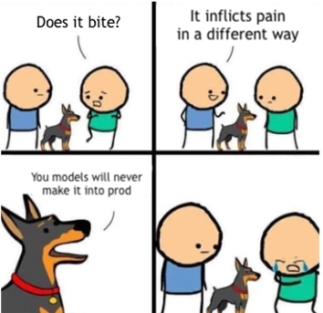

# Введение

Издание VentureBeat [утверждает](https://venturebeat.com/2019/07/19/why-do-87-of-data-science-projects-never-make-it-into-production/), что 87% DS проектов не доходят до прода. Это не единственное такое исследование, есть и [другие](https://designingforanalytics.com/resources/failure-rates-for-analytics-bi-iot-and-big-data-projects-85-yikes/). В целом цифры схожи.

В среднем в ИТ ситуация лучше. Согласно другому исследованию Gartner, ИТ проекты проваливаются в 50% случаях. Под провалом имеют в виду недостижение целей, перерасход бюджета или непопадание в сроки. То есть в итоге ИТ проекты хотя бы доходят до промышленной эксплуатации.

!> 87 % Data Science проектов не попадают в прод

## Почему дата проекты проваливаются?

В книге мы рассмотрим несколько причин провалов AI проектов и разберемся, как перестроить работу так, чтобы увеличить вероятность успеха. Вот эти причины:

* Разные цели у участников проекта
* Разрыв в коммуникациях между бизнесом и командой
* Низкая прозрачность процесса
* Недостаточное командное взаимодействие

Индустрия AI прошла недостаточно большой путь, чтобы обрасти необходимыми методами, инструментами и практиками.  В то же время коллеги из разработки ПО худо-бедно научились справляться с этими сложностями. Можем ли мы просто скопировать их подходы?

И да, и нет. Конечно, нет смысла вслепую проходить тот путь, который прошла индустрия разработки ПО, однако Data Science проекты имеют свою специфику и слепое копирование приносит больше вреда, чем пользы.

В этой книге мы поговорим о практиках, большинство из которых были позаимствованы из Software Development и были адаптированы к Data Science проектам и продуктам.
