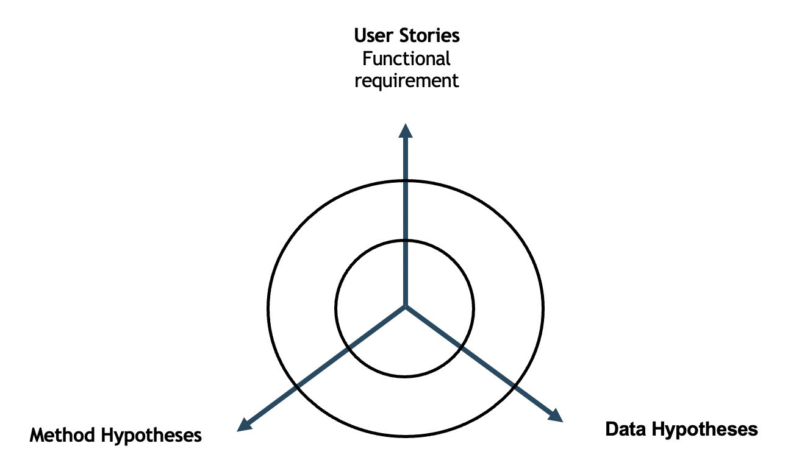
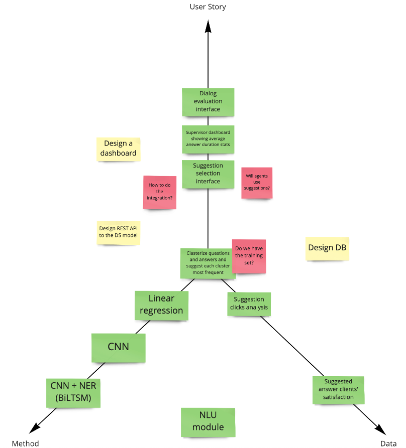
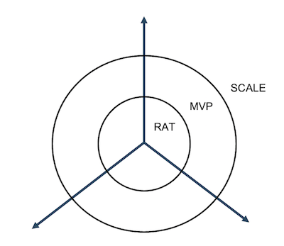
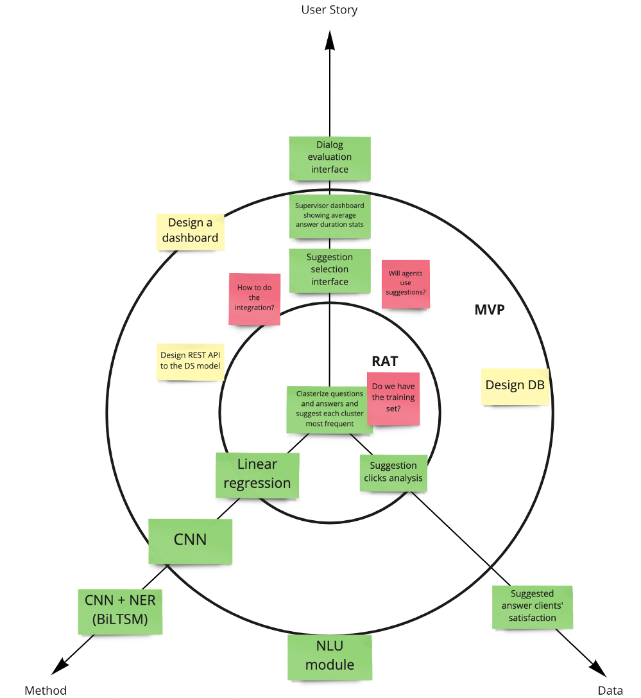

# Декомпозиция методом «Мерседеса»

В главе про Story Map мы говорили о планировании всего софтверного продукта, где ML-продукт является его составляющей. В этой главе мы поговорим о планировании самого ML-продукта. Можно сказать, речь пойдет о создании бэклога для AI-проекта или большой продуктовой гипотезы.

## Зачем нужно планирование

Часто говорят, что создавать планы исследовательских проектов не имеет смысла. Появление новой информации приводит к тому, что с таким трудом созданный план теряет ценность и инженеры разочаровываются в самом процессе планирования.

Давайте разберемся, почему планирование важно и заодно поговорим, каким должно быть правильное планирование.

## Правильный учет рисков

Создание модели может занять долгое время —несколько месяцев. По-настоящему проверить эффективность модели мы сможем ближе к концу ее жизненного цикла, с началом интеграции с другими продуктами, и даже позже — на реальных пользователях и в боевом режиме.

Представьте, что вы долго создавали модель и она даже показывает приемлемые результаты. И вдруг c началом внедрения оказывается, что данные, на которые вы рассчитывали, в проде недоступны и модель не может принести пользу.

Возможно, вы даже интегрировали модель и она показывает разумные результаты на A/B-тесте, однако ревью со стороны комплайенса запрещает вам использовать эти данные из-за юридических проблем.

Конечно, мы могли бы подумать об этих рисках заранее, если бы догадались спросить себя об этом. В этом случае мы бы сэкономили очень много времени.

!> План должен подсвечивать риски и управлять ими.

!> Все команда должна участвовать в планировании

Бывает, что за планирование отвечает DS Lead. Это самый опытный член команды. Он садится, крепко задумывается и пишет план работ. Части плана попадают членам команды уже в виде заданий.

На самом деле в планировании должны участвовать все члены команды. Вырастет качество решений. У участников появляется общий контекст: понимание целей, методов, ограничений и рисков.

В планировании должна участвовать вся команда

!> План должен обеспечивать итеративность и инкрементальность

План должен быть инкрементальным. Мы начинаем с простых и быстрых способов достижения цели и двигаемся к все более сложным.

Иногда команды пренебрегают этим правилом по разным причинам. Например, хочется сделать что-то интересное, а не возиться с простыми методами. Возможно, на более сложном подходе настаивает заказчик.

И, все-таки, начать надо с создания простой модели.

Это позволяет получить начальный baseline — точку отчета, с которой мы будем сравнивать дальнейшие улучшения.
Как правило, бейзлайн удается получить быстро, показать заинтересованным лицам и получить какую-то обратную связь
Даже такую начальную модель имеет смысл начать автоматизировать. Это позволит на практике отловить множество технических рисков интеграции продукта.

!> План должен обеспечивать возможность его изменения

План проекта должен допускать гибкость. При появлении новой информации план можно легко перестроить.

!> План должен фокусироваться на валидации гипотез

Начинать реализацию имеет смысл с наиболее рискованной гипотезы, способной убить проект

## Планирование методом Мерседеса

Давайте рассмотрим процедуру планирования ML-продукта подходом, который мы назвали методом «Мерседеса». Она обеспечивает совместное создание итеративного инкрементального плана, учитывающего ключевые риски.

Планирование методом Мерседеса состоит из 4 шагов:

1. Брейншторминг гипотез
2. Выделение Proof of Concept/MVP
3. Анализ рисков по чек-листам

В сессии планирования участвует вся команда:

* Члены вашей команды
* Специалисты предметной области

При необходимости подключаются и другие заинтересованные лица:

* Представители смежных команд и служб
* Представители бизнеса (заказчики)

## Подготовка к планированию

Подготовьте для сессии три оси, как показано на рисунке.

## Шаг 1. Брейншторминг гипотез

Совместно с командой наклейте идеи гипотез вдоль трех осей:

* **Method Hypothesis**.  Вдоль оси Метод мы располагаем Метод-гипотезы, начиная с самой простой. Например, можно начать с эвристического подхода, затем расположить линейные методы, и лишь потом уже нейронные сети.
* **Data Hypothesis**. Вдоль оси Дата мы располагаем Дата-гипотезы. Начинаем с данных, которые доступны уже сейчас и добавляем новые источники в порядке сложности получения данных.
* **User Stories**. Вдоль оси User Stories мы располагаем пользовательские истории, то есть софтверные работы, которые нужно сделать для достижения финального результата. Их также нужно расположить от простого к сложному.
* **Questions**. В процесс брейншторминга у вас обязательно будут сложности. Например, вы можете не понимать, какие данные доступны или какие интеграции потребуются. Подклейте стикер с соответствующим вопросом. Обычно мы выделяем такие вопросы другим цветом.
* **Technical Tasks**. Инфраструктурные и архитектурные работы, например интеграция модели с бэкендом, развернуть HDFS, создать инфраструктуру запуска модели в проде

В результате должна получиться примерно такая картинка:

## Шаг 2. Выделение Proof of Concept/MVP

К окончанию предыдущего этапа у вас может получиться довольно много гипотез.

Давайте вспомним, что главной задачей является максимально быстрая валидация продуктовой гипотезы. Нам нужно понять, что является более приоритетным, а что можно сделать чуть позже.

Визуально разделяем двумя концентрических кругами на три области, как показано на рисунке

* **RAT (Riskiest Assumption Test)**. Самые рискованные гипотезы, которые можно проверить еще до выкатки на конечных пользователей и убить продуктовую гипотезу.
* **MVP (Minimum Viable Product)**. Минимальный продукт, который можно валидировать на конечном пользователе и проверить гипотезу
* **SCALE**. Дополнительные улучшения и доработки, которые можно отложить на более поздние этапы создания продукта.

Обсудите и распределите ваши гипотезы и пользовательские истории по этим трем категориям. Старайтесь минимизировать RAT и MVP.

Чем ближе к центру, тем выше приоритет гипотезы.

## Шаг 3. Анализ рисков по чек-листам

Управление рисками означает, что на раннем этапе проекта можно провести анализ потенциальных проблем, которые могут ожидать нас в будущем.

В сообществе LeanDS мы собрали набор типичных проблем в виде набора вопросов, которые команда может себе задать.

Пройдите по списку вопросов вместе с командой и попробуйте ответить на каждый из них. Возможны такие варианты:

1. У вас есть ответ на этот вопрос. Двигаемся дальше
2. Вопрос не релевантен к вашей ситуации. Двигаемся дальше
3. Вопрос релевантен, у вас нет хорошего ответа. Повесьте стикер с соответствующей проблемой.

## Особенности использования подхода «Мерседес»

* Итогом сессии является набор заголовков гипотез. После сессии нужно оформить в их в виде гипотез («мы полагаем…»)  и положить их в бэклог продукта
* По мере продвижения к плану работ нужно возвращаться и проводить ревью и апдейт плана
* По длительности «Мерседес» обычно занимает около часа
* Риски могут быть также частью бэклога, если требуют вовлечения со стороны команды.
* Состав вопросов можно пополнить типичными проблемами, характерными для вашего рынка и области применения ML

## Преимущества использования

* Команда и эксперты предметной области совместно придумывает план и разделяет веру в возможность достижения результата
* При появлении проблем команда понимает, как это влияет на итоговый план и может предлагать качественные идеи по изменению плана
* У команды есть список рисков. Если заняться ими достаточно рано, их можно избежать или ослабить их влияние.
* План представляет собой прозрачную картину достижения целей, понятную заинтересованным лицам
* Благодаря использованию RAT/MVP план сфокусирован на быстром тестировании гипотез
* Наличие множества гипотез в плане позволяет распараллелить работу по ним и ускорить создание продукта

?> Эта книга — первое письменное изложение идеи декомпозиции ML проектов методом Мерседеса в истории человечества
