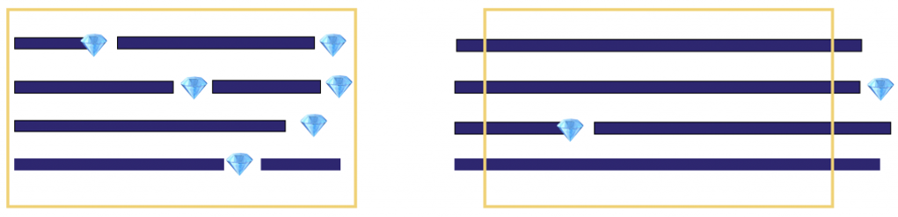

# Выбор подхода

## Какую проблему решаем

Вы сформировали команду проекта. Она состоит из двух DS и одного BE. Как будет работать команда? Вы поговорили с другими руководителями в компании. Большинство используют Scrum. Вы изучили вопрос и Scrum выглядит простым и понятным.

Вот свойства фреймворка Scrum:

* Работа разбивается на короткие отрезки времени, которые называются спринтами. Типичная длина спринта — две недели
* Для каждого спринта определяется цель спринта. Спринт считается успешным, если команда добилась цели спринта.
* Бэклог спринта состоит из пользовательских историй (user stories). Каждая пользовательская история имеет ценность для пользователя
* Пользовательские истории начинаются в спринте и доделываются внутри спринта до конца. Если точнее — они должны соответствовать критериям готовности (Definition of Done). Это означает, что пользовательская история разработана, протестирована, баги найдены, исправлены и закрыты, продукт задеплоен на stage или prod окружение.

Что дает команде такая работа?

* Цель спринта обеспечивает фокус на результате. Грубо говоря, есть чем похвастаться на Sprint Review (встрече c заинтересованными лицами), которая проходит в конце каждого спринта.
* Короткий Time to Market. От момента старта разработки до поставки проходит один спринт, в большинстве команд это 2 недели
* Это очень упрощает планирование. Если мы на самом деле фокусируемся на доделывании до конца наших пользовательских историй, то мы не тянем в следующий спринт доделки и баги с прошлых спринтов. Тогда все прозрачно и понятно!

Выглядит разумно. Вы объясняете команде правила и запускаете свой первый спринт.

Через несколько спринтов вы замечаете несколько проблем:

* Никакой разумной цели спринта, как правило, поставить не получается. Даже если вдруг мы формулируем цель, достичь ее к концу спринта практически невозможно.
* В конце спринта есть куча недоделанной работы, которая в конце просто переносится на следующий спринт
* Внутри спринта из-за discovery-характера DS-проектов может случиться нечто, что полностью уничтожает смысл доделывать спринт до конца.

Scrum работает совсем не так, как в других софтверных командах.

## В чем причина таких проблем?

У всех этих проблем есть одна корневая причина. Для большинства DS-проектов Жизненный Цикл гипотезы намного превышает две недели. По моим ощущениям, реализация гипотезы для большинства DS проектов от момента начала до состояния «готово» занимает 3-8 недель.

В итоге пропадает сам смысл спринта, как периода времени, в течении которого мы должны доделать ценную для пользователя работу от начала до конца.

На картинке слева в течении спринта команда успевает сделать несколько ценных для бизнеса результатов. На картинке справа создание ценного результата занимает больше времени.

Почему же многие DS-команды выбирают Scrum? Мне кажется, тут играет роль некий психологический фактор. Планирование спринта для таких команд выглядит так: каждый DS набирает себе работы на две недели. Это дает ощущение контроля за происходящим и приятное удовлетворение тем, что все заняты и никто не бездельничает.

Как вариант, можно удлинить спринт до двух месяцев или просто относится к концу спринта как к дате встречи по планированию и не требовать завершения ценной работы. Оба этих подхода снижают прозрачность статуса работы. В течении очень длительного периода времени ничего не меняется: задачи не доделываются, нет возможности получить обратную связь.

Альтернативным способом ведения работ является использование метода Kanban.
