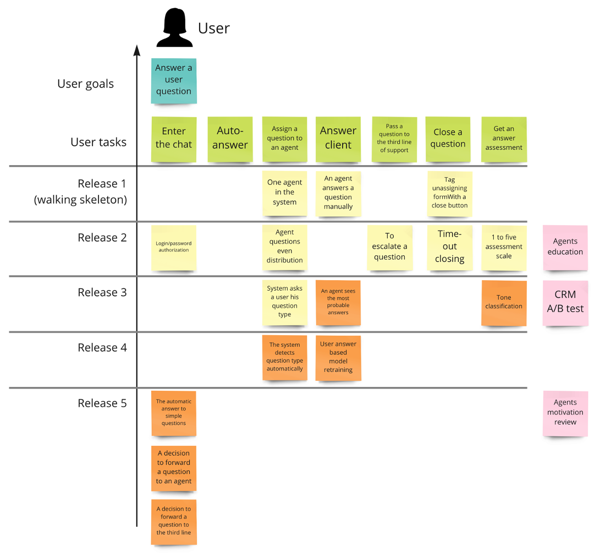
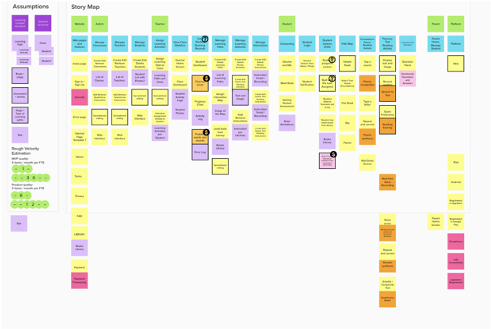
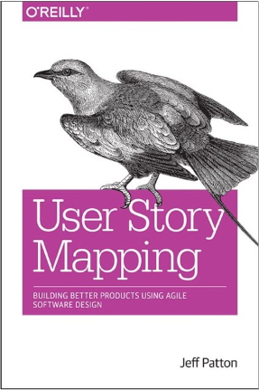

# Story Mapping

## Какую проблему решаем

Вы сделали замечательную модель. Она подсказывает агенту наиболее вероятные ответы. Вы отдаете модель команде CRM и просите интегрировать ее в систему, которой пользуется call-центр. Коллеги забирают задачу и через несколько недель результат попадает в прод.

Однако результат вас расстраивает.

На подсказки никто не кликает. Они находятся за пределами видимости на экране, и их неудобно использовать. Но даже после перестановки выясняется, что ситуация не улучшается: агенты просто не понимают, зачем это нужно.

Кроме того, оказалось что CRM не поддерживает A/B тестирование и мы не можем честно измерить бизнес-эффект. Эта доработка возможна, но ее придется запланировать на следующий квартал.

Что пошло не так?

Конечная цель проекта — решенная проблема бизнеса или пользователя. Часто ML решение является составной частью какого-то большего продукта. Помимо собственно модели, такой продукт содержит и другие компоненты. Он может содержать интерфейс пользователя, должен взаимодействовать с другими системами и продуктами и быть вписанным в бизнес-процессы организации.

Бизнес-процесс, пользовательский интерфейс, взаимодействие с внешними продуктами нужно спроектировать. Конечным итогом такой работы должен стать бэклог продукта — план, содержащий задачи (такие как пользовательские истории) для всех команд, вовлеченных в создание продукта.

## Проектируем продукт при помощи User Story Map

Вы собираете всех вовлеченных людей на встречу по проектированию ML продукта.

!> Story Mapping —совещание по созданию карты проекта или продукта в виде набора пользовательских историй

Точно также, как и в случае AI Canvas, нам понадобится вовлечь всех, кто может дать полезную обратную связь по тому, как спроектировать итоговый продукт.

* Представители бизнеса (заказчики)
* Члены вашей команды
* Специалисты предметной области
* Представители смежных команд

## Как создать Story Map

Создание Story Map проводится за одну или несколько встреч. Проходит оно в примерно в такой последовательности:

* **Создание ролей/персон (actors)**. Напишите на стикерах одного или несколько пользователей (ролей/персон) продукта. Это наши действующие лица, именно они взаимодействуют с системой: конечные пользователи, модераторы систем, агенты и т.д.
* **Пользовательские цели**. Для ключевого актора напишите на стикерах несколько пользовательских целей.
* **Пользовательские задачи**. Для каждой цели напишите несколько пользовательских задач, описывающих как именно наш актор достигает своей цели. Можно относится к пользовательским задачам как шагам бизнес-процесса.
* **Walking Skeleton**. Под каждой пользовательской задачей добавьте стикер, каким самым простым образом можно изменить систему, чтобы достичь цели.
* **User Stories**. Под Walking Skeleton мы располагаем улучшения и дополнения функциональности нашего продукта.
* **Technical Tasks**. Добавьте на Story Map инфраструктурные и архитектурные работы
* **Questions**. Во время обсуждения могут возникнуть вопросы без ответа. Повесьте их в виде стикеров, они останутся как домашняя работа.
* **AI Hypothesis**. Проанализируйте, где именно применение ML может автоматизировать бизнес-процесс и повесьте по стикеру про каждую такую идею

## Пример Story Map

В итоге у вас должен получиться примерно такая Story Map:

Обратите внимание, что в этом примере мы разделили продукт на 5 релизов:

* Release 1. Walking Skeleton. Основа продукта, на которую мы будем нанизывать последующую функциональность
* Release 2. MVP без ML. Ручной ответ агентов в чате. Мы готовы выйти в прод на небольшой сегмент пользователей с этим набором функциональности
* Release 3. Подсказки агентам наиболее вероятных ответов при помощи ML
* Release 4. Автоматический роутинг (передача) агентам по их специализации
* Release 5. Автоматический ответ системы на простые вопросы

Кроме этого, мы нашли 3 риска, и должны будем их как-то адресовать в процессе проекта.

## Хинты создания Story Map

* Иногда бизнес-процесс оказывается нелинейным. Однако, нет смысла строить диаграммы из стикеров. Относитесь к Story Map как к истории, которую вы рассказываете заинтересованным лицам.
* Иногда части бизнес-процесса повторяются (например, для разных акторов). Нет смысла их дублировать — для следующего актора вносите только изменения.
* Walking Skeleton это техническая основа для будущего продукта. Это не Minimum Viable Product, так как далеко не всегда его можно выпустить на реальных пользователей. Тем не менее большинство «граблей» мы соберем при его создании.
* Как только Walking Skeleton создан, мы имеем возможность инкрементально улучшать наш продукт.
Приоритет располагается слева направо сверху вниз по слоям. Удобно прочертить предполагаемые релизы прямо на доске.
* Создание Story Map — важнейшая часть проектирования продукта и может занять значительно время — от нескольких часов до пары дней для крупного продукта.
* У некоторых важных стейкхолдеров нет столько времени. Сделайте ревью с ними вашего Story Map после его создания: совместно пробегитесь по нему, соберите обратную связь и внесите коррективы.
* Итоговый Story Map обязательно будет меняться по мере того, как вы строите ваш продукт и получаете обратную связь. При необходимости Story Mapping можно повторить (например, после каждого релиза).
* Наиболее важен ближайший релиз. Проектировать бэклог глубоко по слоям вниз — потеря времени. Ваше представление о том, как надо решать задачу поменяется.

## Когда использовать Story Map

* Проектирование всего продукта, где ML является важной, но не единственной его составляющей.
* Для анализа точек применения ML в организации. В этом случае Story Map представляет собой карту бизнес-процессов организации. Члены команды ищут точки, где ML может быть потенциально применен и принесет пользу.

## Когда нет смысла использовать Story Map

Когда задача команды — »прикрутить» ML к уже существующему и работающему бизнес-процессу и при условии, что сам бизнес-процесс сильно не изменится.

## Преимущества Story Mapping

* Проектирование продукта требует сфокусированной креативной совместной работы
* Планирование и проектирование важнее собственно плана. Вовлечение всех заинтересованных лиц в проектирование создают чувство ответственности за финальный результат
* Итогом Story Mapping является бэклог продукта. Если отслеживать прогресс по бэклогу (то есть отмечать, какие работы сделаны, а какие еще нет) можно получить прозрачную картинку по реальному прогрессу.

## Практическое использование Story Mapping

Story Map можно создать на очной встрече при помощи стикеров разных цветов. Можно собраться на распределенную встречу и воспользоваться одним из инструментов совместной распределенной работы: miro.com, mural.co и др.

## About Story Mapping

?> Поход был предложен Джеффом Паттоном и популяризирован в его книге [User Story Mapping](https://www.amazon.com/User-Story-Mapping-Discover-Product/dp/B08TZGKKF2). Он оказался удивительно удобным для проектирования в том числе ML продуктов. Единственное изменение, которое мы внесли в подход — добавили шаг по генерации AI гипотез.

