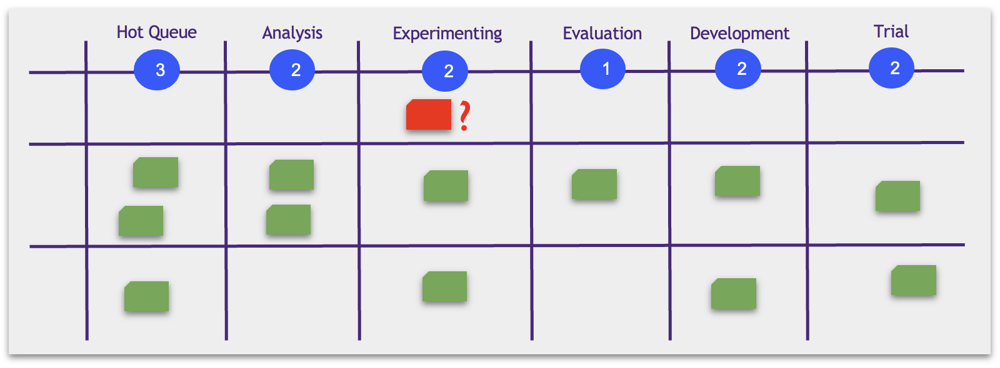

# Срочные задачи (Expedite) и Swimlanes

У одного из клиентов обнаруживается проблема: по какой-то причине модель в проде перестала показывать хорошие результаты. Вы завели новый баг и он сразу попадает на этап Experimenting.

Это срочный баг, мы теряем деньги из-за того, что модель не работает. Но как быть с ограничением WIP? В колонке Experimenting не может быть больше двух тикетов!

Действительно, мы не хотим нарушать правила. Откатывать назад множество тикетов, чтобы искусственно соблюсти правило тоже не разумно.

Вместо этого мы выделяем полосу движения (swimline) для срочных тикетов и договариваемся о новом правиле: в этой полосе тикет может нарушать ограничения WIP.

Тикеты такого типа называются Expedite (ускоренными).

Таких дорожек (swimlines) можно сделать несколько и по каждому из них пустить отдельные категории работ:

* Отдельные ML-продукты или продуктовые гипотезы
* Типы работ
* Различные заказчики
* …
