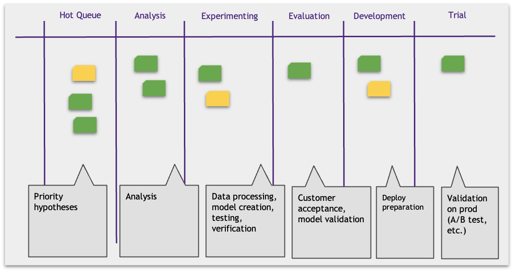
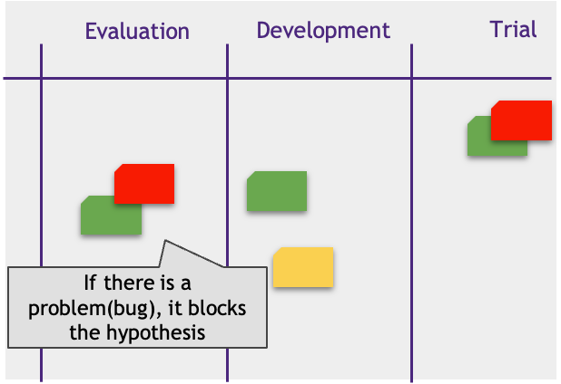
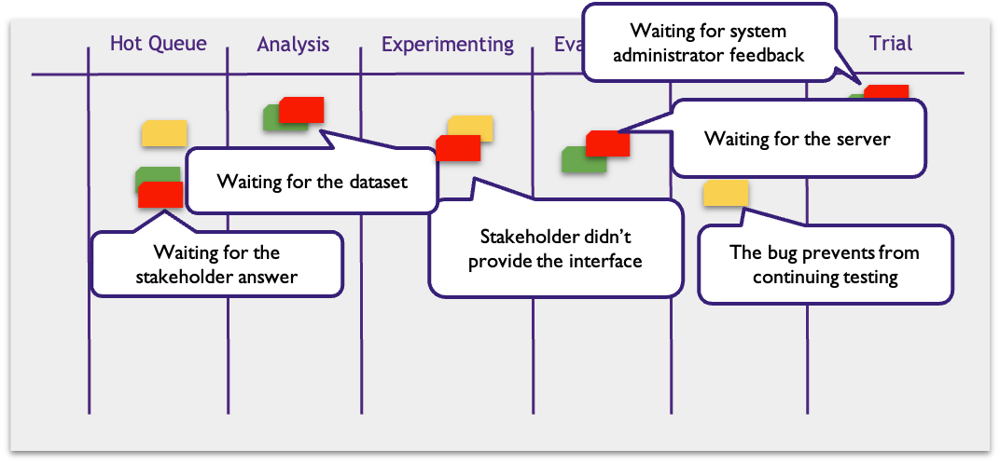
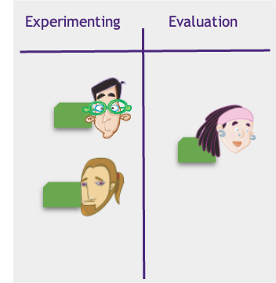
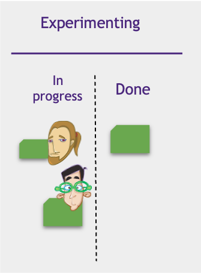
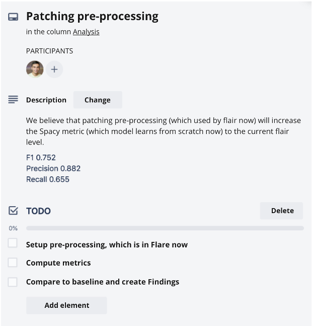

# Визуализация работ

## Колонки канбан-доски

Как можно повысить прозрачность работ? Конечно, каждая гипотеза может быть либо сделанной, либо находится в работе. Многие гипотезы выполняются долго и наличие некоторой промежуточной информации о ее статусе повысило бы прозрачность.

Канбан предлагает визуализировать промежуточные этапы жизни гипотезы на канбан-доске при помощи отдельных колонок.

Каждая работа превращается в тикет (tiket) и помещается на доску. Тикеты двигаются по доске слева направо, перемещаясь из колонки в колонку по мере изменения статуса. Проваленные гипотезы убираются с доски.

Доска вашей команды может выглядеть по-другому. Например, вы можете захотеть разбить колонку Experimenting на Data Preparation (подготовка данных) и Modelling (создание модели).

## Блокеры

Иногда член команды не может продолжить работу над гипотезой из-за проблемы. Например, мы ждем выборку от клиента. Почему бы не переключиться пока на другую гипотезу?

Таких проблем может быть множество. Все они замедляют работу над гипотезами и ухудшают Time2Value.

Давайте визуализируем блокирующие проблемы. К тикету гипотезы подклеим стикер с описанием блокирующей проблемы. Тогда один взгляд на доску скажет нам, сколько и каких гипотез заблокировано.

На блокере можно указать предполагаемые сроки решения и ответственного члена команды.

## Визуализация ответственности

Эдик сегодня занимается созданием модели. Для того, чтобы это визуализировать, он прикрепляет свой аватар на соответствующий тикет. В качестве аватара на живой доске мы часто используем фотографию. В электронных досках это делается по-разному, в зависимости от инструмента, например можно указать ответственного (responsible). Как только Эдик закончил свою часть работы, он убирает свой аватар с тикета.

* Одной гипотезой может заниматься сразу несколько человек и тогда на ней указывается сразу несколько аватаров.
* Гипотеза может перейти к другому человеку и тогда аватар меняется на новый.
* Если гипотезой никто не занимается, очевидно, на нет ней аватаров.
* По аватару мы видим, кто отвечает за задачу и ожидаем от этого человека отчет по задаче на стендапе.

## Вытягивание

Бекэнд разработчица Беки занимается оценкой и автоматизацией моделей, которые строят сайентисты Эдик и Тим. Процесс передачи работ можно визуализировать следующим образом. Колонка разделяется на две части: In progress и Done. Пока идет работа над гипотезами, их тикеты находятся в подколонке In Progress. Как только работа закончена - они перемещаются в подколонку Done. Это сигнализирует Беки, что она может ими заняться.

## Тикет

В большинстве команд используются электронные доски управления задачами: Jira, Kanban, Trello, Redmine и т.д.

По такой доске двигаются электронные тикеты. Вот составляющие элементы этого тикета:

* Название. Короткое и запоминающееся название гипотезы
* Описание. Сформулированное в виде гипотезы описание
* Member. Ответственный за тикет член команды.
* Чек-лист задач
* Комментарии

Чек-лист задач — список работ, которые надо сделать по тикету. Не обязательно планировать все работы по тикету вплоть до его валидации. Это вполне может быть набор самых ближайших и понятных задач. Относитесь к этому списку как TO DO листу, а не коммитменту. В любой момент можно удалить/добавить или изменить элементы этого списка.

Чек-лист удобно обсуждать совместно с другими членами команды. Это повышает прозрачность и вовлеченность участников.

## Пример тикета в Trello

