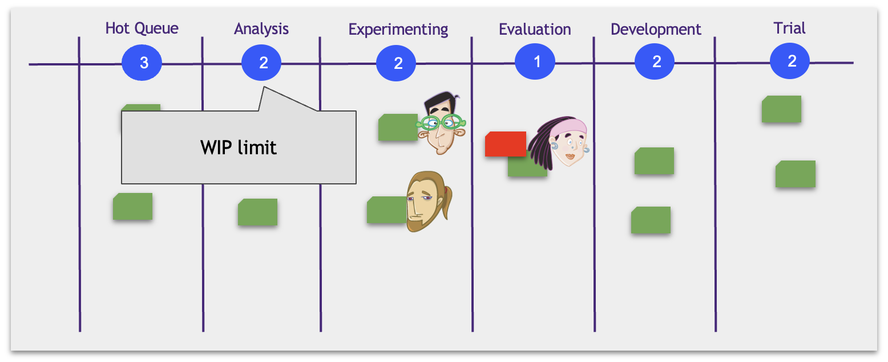
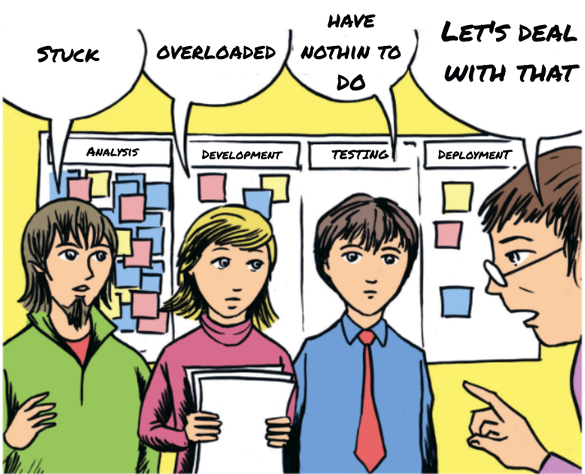

# Ограничение количества одновременно выполняющейся работы

## Закон Литтла

Представьте себе, что вы оказались в очереди в Starbucks за стаканчиком любимого напитка (я лично предпочитаю капучино на кокосовом молоке). Перед вами в очереди 10 человек. Кафе покидает примерно 1 человек в минуту. Через какое время вы получите свой напиток? Очевидно, вам придется подождать примерно 10 минут = 10 человек / 1 человек в минуту.

В теории массового обслуживания существует закон Литтла (Little’s Law), который гласит, что среднее время цикла (времени обслуживания) элемента равняется среднему количеству элементов в системе поделенное на среднюю скорость обслуживания.

В моем примере вы сами являетесь элементом системы. Тогда Lead Time — среднее время ожидания в очереди, Work In Progress — среднее количество людей в очереди, а Throughput — средняя скорость обслуживания, то есть среднее количество покупателей, выходящих с напитком из магазина за минуту.

Закон Литтла работает для любой системы массового обслуживания. Вы можете оказаться в большом торговом центре, где есть кофе-пойнты, магазины и рестораны. И даже в этом случае среднее время присутствия человека в торговом центре равно среднему количеству людей внутри торгового центра, поделенному на среднюю скорость выхода людей из него.

Давайте применим закон Литтла к тикетам на канбан-доске. Получается, что для снижения среднего времени прохождения тикета нам надо либо снизить количество тикетов на доске либо увеличить пропускную способность (скорость) нашей системы.

Теперь понятно почему важно ограничить максимальное количество тикетов на канбан-доске. Такое ограничение в канбане называется WIP-limit (Work in Progress limit).

## Как работает ограничение WIP в Канбан

Над каждой колонкой мы пишем максимальное количество тикетов (WIP), которые могут быть в этой колонке.

Эдик закончил работу, модель готова и перед отправкой на автоматизацию ее нужно проверить. Она попадает на этап Evaluation к Беки. Она находит проблему.

Эдик освободился и по идее может взять в колонку Experimenting новую интересную работу. Но ему не дает ограничение WIP=2. Ему придется решить проблему с багом и лишь потом он сможет переключиться на новую гипотезу.

Ограничение WIP заставляет команду работать совместно и фокусироваться на доделывании работ.

* Теперь мы не можем игнорировать блокеры. Если их станет слишком много, нам придется ими заняться.
* Если кто-то из членов команды перегружен работой, то на доске появятся очереди и опять таки, ограничение не даст нам их игнорировать.
* Освободившийся человек займется наиболее приоритетной работой

Иллюстрация с обложки книги Дэвида Андерсона “Kanban: Successful Evolutionary Change for Your Technology Business”
