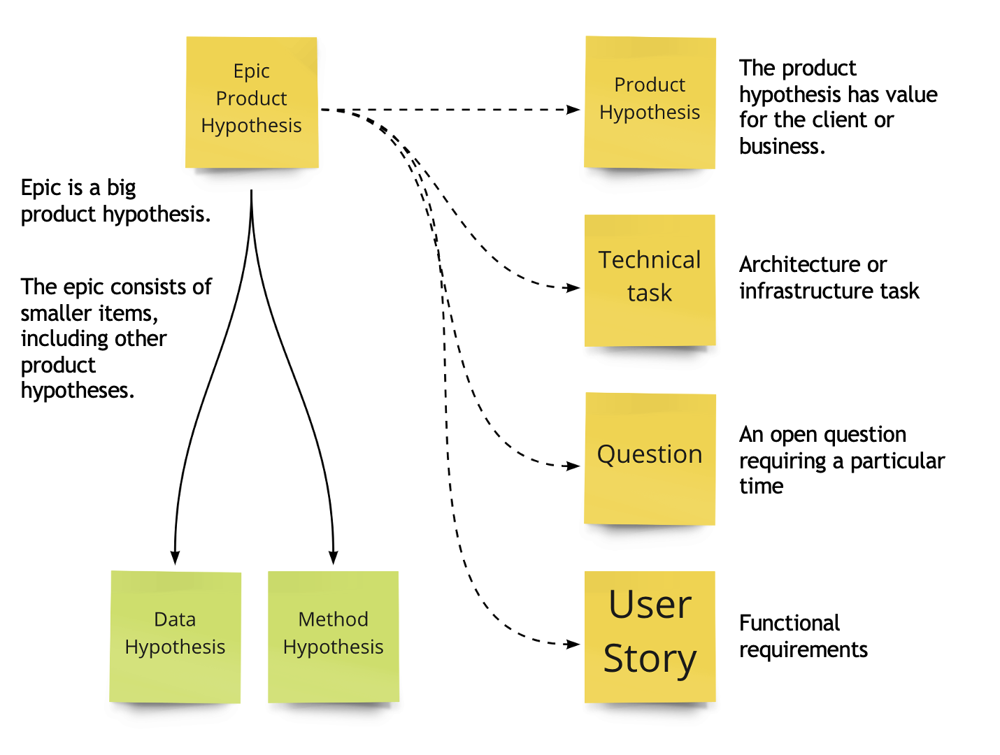

# Типы работ (Work Item Types)

Давайте поговорим о том, какие тикеты ходят по доске

Слово «Эпик» означает, что работа большая. Обычно у команды 1-3 эпика в работе и помещать их на доску команды не имеет смысла. Они там просто не будут двигаться. 
