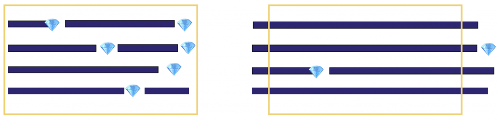

# Selecting Approach

## A Problem We Solve

You've built the project team. It consists of one DS and one BE. How would it operate? You've talked with other team leaders in your company. Most of them use Scrum. You've looked into it, and it seems pretty reasonable.

## Scrum Features

* The team splits the job into short time intervals called Sprints with a typical length of two weeks.
* Each Sprint has a goal. A sprint is successful if the team reaches it.
* A Sprint backlog consists of user stories. Each user story creates value for a user.
* The user story starts in Sprint and ends when it finishes. More precisely, it should meet the Definition of Done criteria. It usually means that the team develops a user story, tests it, fixes all the bugs and deploys it to stage or production.

## Why Scrum works

* A sprint goal helps the team to focus on the result. Roughly speaking, it gives it something to brag about at the Sprint Review (the reporting meeting at the end of each Sprint).
* Short Time to Market. All the work, from start to deployment, takes one Sprint.
* It simplifies the planning significantly. If the team finishes the Sprint backlog and doesn't drag the previous sprints' bugs into the next, the entire process runs like clockwork.

## What Could Go Wrong?

Looks reasonable. You explain the rules to the team and launch your first Sprint.

A few Sprints later, you notice several issues:

* It is tough to set a reasonable Sprint Goal. Even if formulated, it is almost impossible to reach by the end of the Sprint.
* The team has a pile of unfinished work by the end of each Sprint and moves it to the next one.
* Sometimes, the discovery nature of DS projects manifests itself, rendering the Sprint goal pointless and making finishing the Sprint pointless as well.

Scrum doesn't work in Data Teams as it works in typical software engineering teams.

## What is the Cause of These Problems?

All these problems have one root cause. Most hypotheses lifecycle is much longer than two weeks: typically 3-8 weeks from idea to deployment.

Such a long lifecycle is the reason why using Sprints makes no sense. Sprint is a two-week period during which the team does valuable work from start to finish.

The left figure shows the team accomplishing one or more jobs. The right figure shows when the average time needed to achieve a result valuable for business is longer than one Sprint.

So, why do so many DS teams stick to Scrum? I believe there is a psychological factor. Each team member is assigned enough tasks for two weeks to keep everyone busy — this provides a sense of control and satisfaction.

How do data teams fix typical scrum problems?

Some expand the Sprint duration up to two months. Others use Sprint meetings for planning, not even trying to finish ongoing jobs before the next Sprint.

Both approaches reduce transparency. Over an extended period, nothing changes. Problem statuses remain the same, with no possibility of getting feedback.

There is an alternative method of handling this: Kanban.
