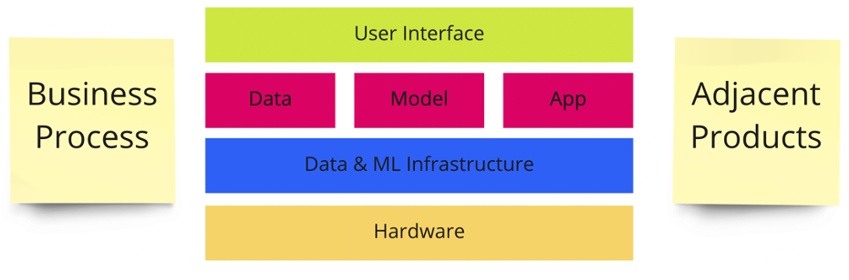

# Story Mapping

## A Problem We Solve

You have created an exceptional model that suggests the most probable answers to an agent. So, you pass it to the call center for integration. A few weeks later, the CRM team deploys it to production.

But the results aren't satisfactory.

Operators do not click on your answers. The suggestion box is below the first screen, and no one scrolls down there. You move the answers up to the first screen, but that makes no difference. Agents still don't get what this box is about.

Moreover, it turns out that you can't measure the impact because CRM does not support A/B testing. You can schedule that, but only for the next quarter.

What went wrong?

Any project's ultimate goal is to help a business or an end-user. Most of the time, ML is an integral part of some bigger product. Apart from the model itself, such a product has many other components. Among others, it may have a user interface, interact with other products, and be deeply rooted in the IT ecosystem. Also, it must blend in with the company's business model and processes.

You need to design all parts of this equation and how they will interact with each other. The product backlog will be the final result of this work. It will include all the essential details, such as user stories for all the teams involved in the project.

## Designing a Product With a User Story Map

An ML product design meeting requires all the stakeholders' involvement.

!> Story Mapping results in a project or a product map in the form of a set of User Stories.

When designing a product, you will need everyone who can give productive feedback, like with AI Canvas:

* Business team (internal clients)
* Your team members
* The subject matter experts
* Representatives of the related teams

## How to Create a Story Map

You would need 1-3 meetings to create a Story Map. Typically, the following steps are taken:

* **Roles/personas**. Start with describing User roles (personas). Take sticky notes and write down Actors working with the product: end-users, moderators, agents, etc.
* **User goals**. Write down several User Goals on separate sticky notes for the main actor.
* **User Tasks**. Describe every goal as a list of several User Tasks leading to it, where each task can be seen as a step in a business process.
* **Walking Skeleton**. Under each User Task, place a sticky note describing the simplest way to implement a functionality allowing a user to perform the task.
* **User Stories**. When the Walking Skeleton is complete, place all the improvements and additional product functionality on the lines below.
* **Technical Tasks**. Next, expand your Story Map with items describing infrastructure changes and general backend development.
* **Questions**. You may leave some questions unanswered during the discussion. Add them as separate sticky notes.
* **AI Hypothesis**. Review the board again. Attach sticky notes with ideas to the User Stories that can be improved with ML.

## Story Map Example

We split it up into five releases:

* **Release 1**: Walking Skeleton. It is a basis. We will use it as a foundation for the rest of the product functionality.
* **Release 2**: MVP without ML. Agents answers in the chat manually. We can target a narrow customer segment with this release.
* **Release 3**: ML suggests the most probable answers to agents.
* **Release 4**: Agents receive requests based on their area of expertise.
* **Release 5**: The system automatically answers simple questions.

Also, we discovered three risks we must also address at some point.

## Story Map Hints

* If your business process is non-linear, you may be tempted to enhance User tasks or other parts with additional arrows or in some other way. Don't do that. It will only waste your time and make the diagram harder to read. Instead, treat each section as if you're telling a simple story.
* Sometimes business processes' parts may repeat each other (for instance, for different Actors). Rather than duplicate sticky notes on the following Actor diagram, indicate differences.
* A Walking Skeleton is a technical foundation for your product. It will help discover most of the trouble spots. But don't confuse it with MVP since it is unlikely good enough to be used by end-users.
* Walking Skeleton is a starting point for improving the product incrementally.
* Prioritize layers from top to bottom. Separate your releases on a board with horizontal lines.
* Your Story Map is a crucial component of your product design. Its creation may take from a few hours to a few days for a complex product. And that's fine.
* Some of your stakeholders may be unable to attend. Review the Story Map with them when it is finished.
* Your story map will evolve as you build the product and collect feedback. You may want to recreate it, for instance, with every new release.
* Too many details at the bottom of the map is a waste of time. Your perspective will change more than once during the project, making the next release the one that matters most.

!> You might find out that the first few releases of the product do not have any ML.

## When a Story Map May Be Helpful

* When we need to build a product where ML is critical, but not the only one.
* When ML significantly changes existing business process.
* When we want to identify opportunities for applying ML in a company. In this case, we build Story Map for business processes.

## When a Story Map is Redundant

* If one needs to add ML to an existing business process without altering it too much.

## Story Mapping benefits

* It ensures creative and collaborative teamwork, which is crucial for a good product design.
* Planning and designing process has value because it gives a sense of ownership for the final product to all the parties.
* The Story Map can be perfect for monitoring project progress. One needs only to track backlog and update the statuses of the completed tasks on the board.

## Story Mapping in Reality

Often, it only takes a meeting and a bunch of sticky notes. The session can also be virtual. You might utilize  online collaboration tools like [miro.com](https://miro.com), [mural.co](https://mural.co), and many others.

## About Story Mapping

?> Initially, it was formulated and popularized by Jeff Patton in [his book "User Story Mapping"](https://www.amazon.com/User-Story-Mapping-Discover-Product/dp/B08TZGKKF2). It turned out to be surprisingly convenient for product design. We refined it for ML by adding a few finishing touches and the AI hypothesis generation step.

