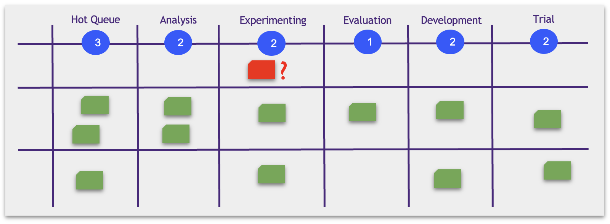

# Urgent Tasks (Expedites) and Swim Lanes

One of the clients has a problem: for some reason, the model in the production stopped showing positive results. You create a new bug, and it immediately goes to Experimenting.

It's an emergency: the model doesn't work, and we're losing money. But what about the WIP restriction? The Experimenting column cannot have more than two tickets!

Indeed, we do not want to break the rules. The voluntary decision to put other tickets on hold is not reasonable, either.

Instead, we create the dedicated lane for emergency tickets (swim lane) and set a new rule: the WIP restrictions don't apply there.

Tickets of this type are called Expedited (Accelerated).

We may have separate swim lanes for different ticket categories:

* ML products and product hypotheses
* Different stakeholders
* ... other
