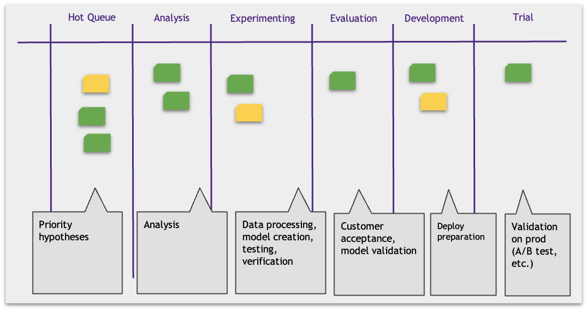
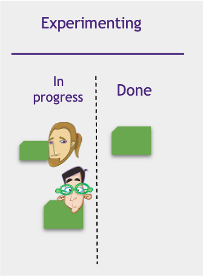
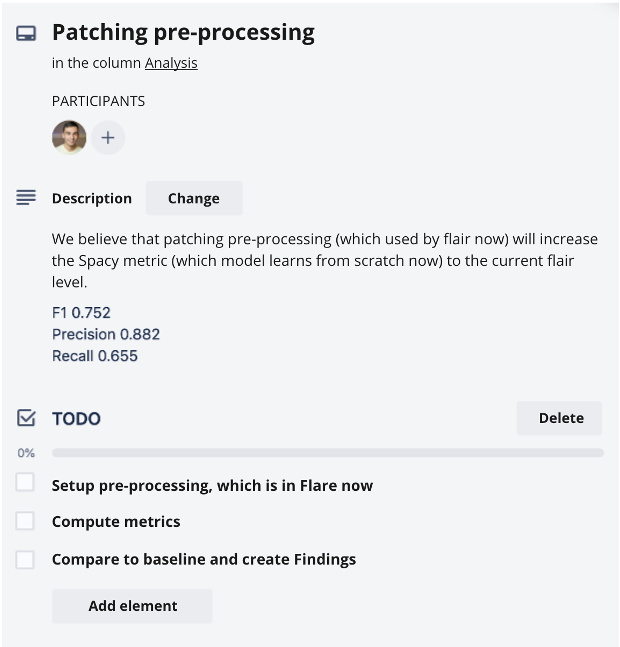

# Visualization

## Kanban Board Columns

How can we make the work more transparent? Many hypotheses are long-term. And having some intermediate information about their statuses would increase transparency.

Kanban proposes to visualize the hypotheses workflow stages on the Kanban board using separate columns.

Each work turns into a ticket and appears on the board. Tickets move column to column, from left to right as the status changes. Failed hypotheses leave the board.

## Kanban board example

Your team board might look different. For example, you might want to split the Experimenting column into Data Preparation and Modelling.

## Blockers

Sometimes a team member cannot continue their work on a hypothesis because of a problem. For example, they wait for a dataset from the client or don't have access to a server. Usually, a person switches to another ticket on the board.

There may be many problems like this. They delay the work on hypotheses and negatively affect Time2Value.

Let's visualize the blockers by attaching their sticky notes to the hypotheses they block. So, one look at the board will tell us how many and which hypotheses are blocked. The blocker may have the info on its ETA and the team member in charge.

## Examples of Blockers

## Responsibility Visualization

Joe creates a model. To visualize that, he attaches his avatar to the ticket while he works on it. On a physical board, we often use photos as avatars. Electronic kanban boards have different ways to do that. For example, you can use the field "Assignee ".

* One hypothesis may involve multiple people. The ticket then will have several avatars (assignees).
* The hypothesis can be reassigned, and then the avatar changes.
* The hypothesis has no avatars when it is idle.
* An avatar indicates responsibility. Appropriate person reports on the task at the stand-up.

## Pulling tasks

Becky evaluates and integrates the models built by Data Scientists Joe and Tim. You can visualize that as follows. Divide the column into "In progress" and "Done". Hypotheses go to "In progress" when they start and to "Done" when they finish. It signals to Becky that she can proceed.

## Ticket

Most teams use online boards: Jira, Kanban, Trello, Redmine, etc. The typical elements of the tickets moving along these boards are:

* Name: short and memorable hypothesis name
* Description: hypothesis statement
* Member/Assignee: team member responsible for the ticket
* Tasks (to-do) checklist
* Comments section

The tasks checklist is a ticket work to-do list. It is not necessary to plan every tiny detail of the hypothesis from start to validation. It is rather a set of tasks you have at hand now. You can delete/add or change elements on it at any time.

Checklists can be discussed with any team member, which increases transparency and engagement.

## Ticket example

