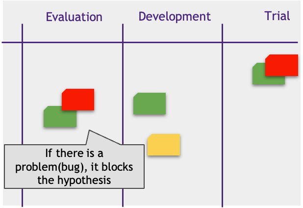

# Work Visualization

## Kanban Board Columns

How can you make the work more transparent? Of course, every hypothesis can be either complete or in the pipeline. Many hypotheses are long-term. And having some intermediate information about their statuses would increase transparency.

Kanban proposes to visualize the hypotheses pipeline stages on the Kanban board using separate columns.

Each work turns into a ticket (ticket) and appears on the board. Tickets move column to column, from left to right as the status changes. Failed hypotheses leave the board.

## Kanban board example

Your team board might look different. For example, you might want to split the Experimenting column into Data Preparation and Modelling (model creation).

## Blockers

Sometimes a team member cannot continue working on a hypothesis because of a problem. For example, he waits for a dataset from the client. Can he easily switch to another hypothesis for a while? Probably not.

There may be many problems like this. They delay the work on hypotheses and negatively affect Time2Value.

Let’s visualize the blockers by attaching their stickers to the hypotheses they block. So, one look at the board will tell us how many and which hypotheses are blocked. The blocker may have the info on its ETA and the team member in charge.

## Examples of Blockers

## Responsibility Visualization

Joe creates a model. To show that, he attaches his avatar to the ticket while he works on it. On an actual board, we often use photos. Electronic whiteboards have many ways to do that. For example, you can use the field "responsible“.

* One hypothesis may involve multiple people. The ticket then will have several avatars.
* The hypothesis can be reassigned, and then the avatar changes.
* The hypothesis has no avatars when it is idle.
* An avatar indicates responsibility. This person reports on the task at the stand-up.

## Transfer

Becky evaluates and integrates the models built by Data Scientists Joe and Tim. You can visualize that as follows. Divide the column into “In progress” and “Done”. Hypotheses go to “In progress” when they start and to “Done” when they finish. This signals to Becky that she can proceed.

## Ticket

Most commands use online boards: Jira, Kanban, Trello, Redmine, etc. The typical elements of the tickets moving along these boards are:

* Name: short and memorable hypothesis name
* Description: hypothesis statement
* Member: team member responsible for the ticket
* Tasks checklist
* Comments

The tasks checklist shows the ticket work items. It is not necessary to plan every tiny detail of the hypothesis from start to validation. This may well be a set of tasks you clearly have at hand now. Refer to it as a to-do sheet rather than a list. You can delete/add or change elements on it at any time.

Checklists are available and can be discussed with any team member, which increases transparency and engagement.

## Trello ticket example

