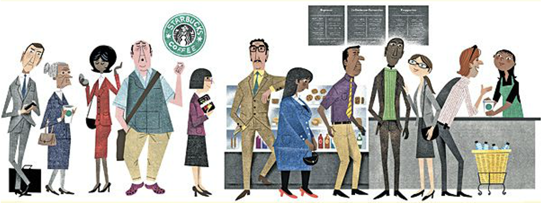
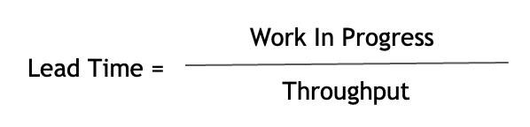
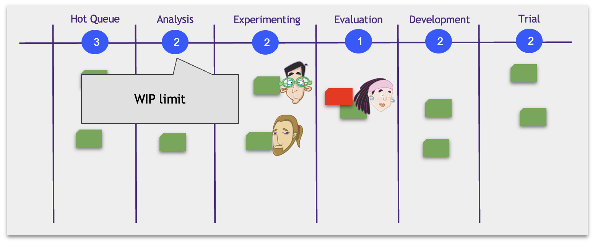
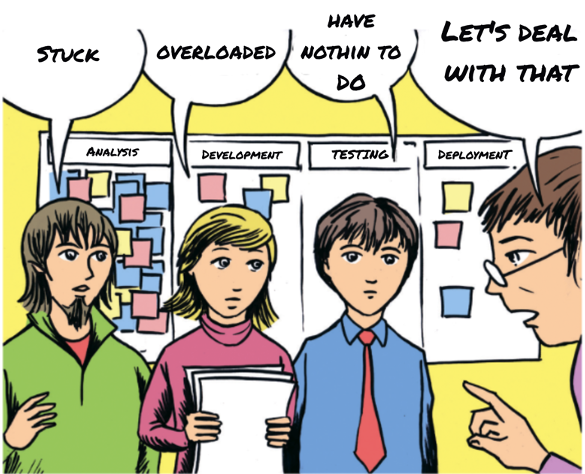

# Little’s Law

Imagine yourself at Starbucks waiting for your favourite drink. There are 10 people in the line. About one person per minute leaves the cafe. How long before you get your drink? You'll have to wait about 10 minutes = ten people/one person per minute.

There is a law (Little's Law) in the mass service theory. It states that the average service time of an element in the system equals the element’s number divided by the total system service speed.

In my example, you are part of the system:

* Lead Time is the average queue waiting time.
* Work in Progress is the average number of people in the queue.
* Throughput is the average service speed: the average number of people leaving the store with a drink per minute.

Little’s Law works for any mass service system. You can find yourself in a large shopping mall with coffee points, shops, and restaurants. Even so, your average time in there is the average number of people inside a mall divided by the average speed of people leaving.

Let's apply Little’s Law to the Kanban tickers. To reduce the average implementation time, we must either reduce the board tickets number or increase our system's bandwidth (processing speed).

It is now clear why we need to limit the maximum tickets number on our Kanban board. This restriction is called a WIP limit (Work in Progress limit).

## How WIP Limit Works in Kanban

Above each column, we write the maximum number of tickets (WIP) that it may have:

Joe has finished the model. The next step is to check it before the integration. It falls into Becky's Evaluation stage. She finds the problem.

Joe is free now and can take a new fascinating job in the Experimenting column, but the WIP=2 restriction doesn't allow that. He'll have to fix the bug first, and only then can he switch to a new hypothesis.

The WIP limitation helps the team focus on finishing stuff by working together:

* We can't ignore blockers anymore. If there are too many, we must deal with them.
* If one of the team members is overworked, there will be queues on the board. And again, the restriction will prevent us from ignoring them.
* Anybody who finished their job will take on the highest priority next.

Illustration from the cover of David Anderson's book, "Kanban: Successful Evolutionary Change for Your Technology Business"
