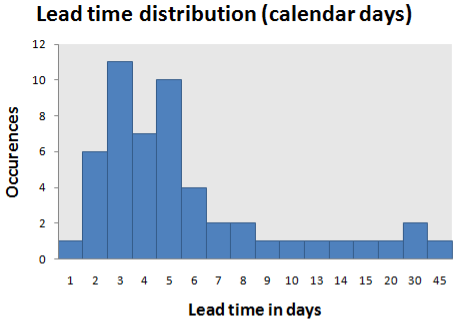
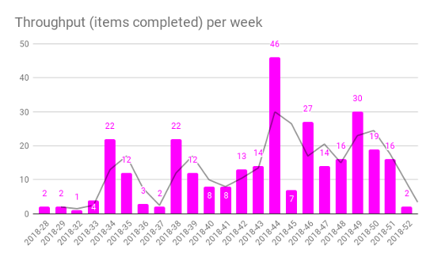

# Workflow Management

One of the Kanban key ideas is managing work, not people. We design the Kanban board, helping the participants to self-organize using its workflow. We aim to ensure flow stability, decreasing tasks' Lead Time and increasing total Throughput.

To ensure that, we:

* Configure columns.
* Set WIP limitations.
* Create explicit Policies.

While striving for the best performance, change is inevitable. And we constantly put some system screws on. Due to the process design, which is transparent and self-explanatory, the team can simultaneously use and propose its improvements.

There are several metrics and diagrams to evaluate these improvements. Numerical flow control is an exciting and vast topic. So, we will only look at two examples.

## Lead Time Distribution

This diagram allows estimating Lead Time, an average time required by one ticket of a specific type. The X-axis represents the Lead Time, and the Y-axis represents the corresponding tickets number. You may want to consider the Lead Time median and its 85% percentile. The team’s goal is to bring Lead Time down to the target level.

## Throughput Diagram

Bandwidth is the second important metric. It shows the team's amount of work in one unit of time (for instance, in a month). It is interesting to compare this metric to the Demand (the number of new tickets in the backlog). If the Throughput is significantly smaller than the Demand, think about expanding the team.

?> The Kanban method was initially proposed by David Anderson and first published in [Kanban. Successful Evolutionary Change for Your Technology Business](https://www.amazon.com/Kanban-David-J-Anderson-ebook/dp/B0057H2M70/).
