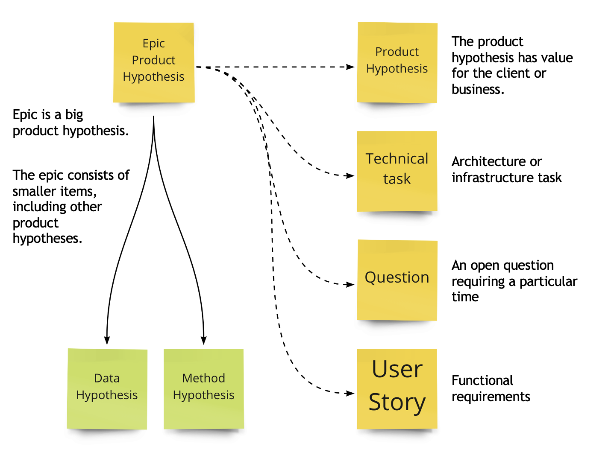

# Work Items

Let's see which types of tickets we may have on the board:

The word «Epic» means that the work item is significant. A team may have 1-3 active epics. It makes no sense to put them on the board. They won't move.
